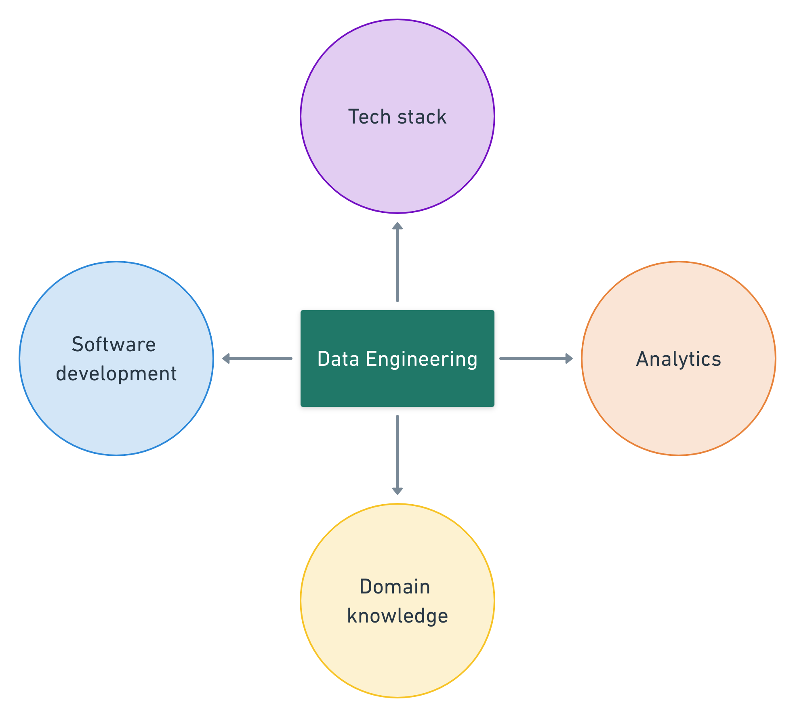
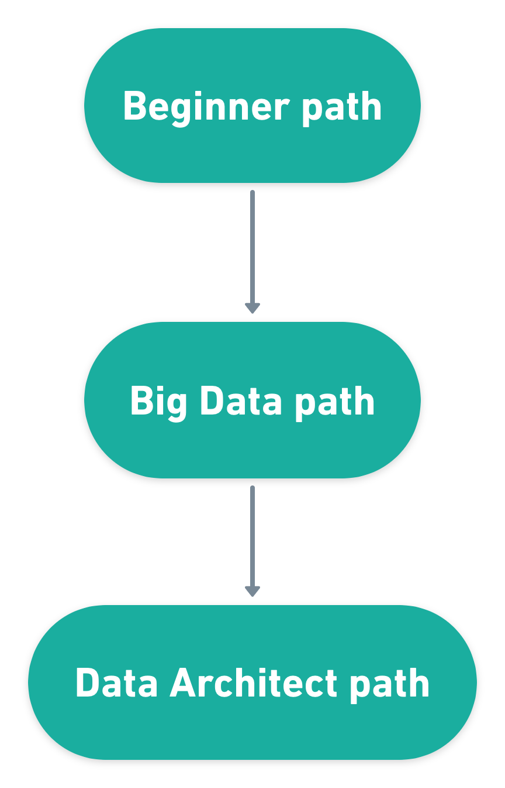
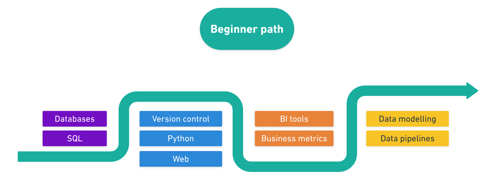
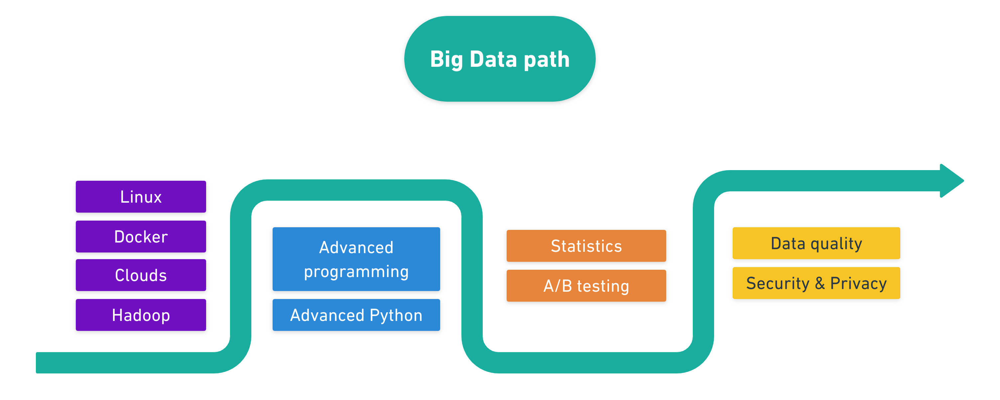
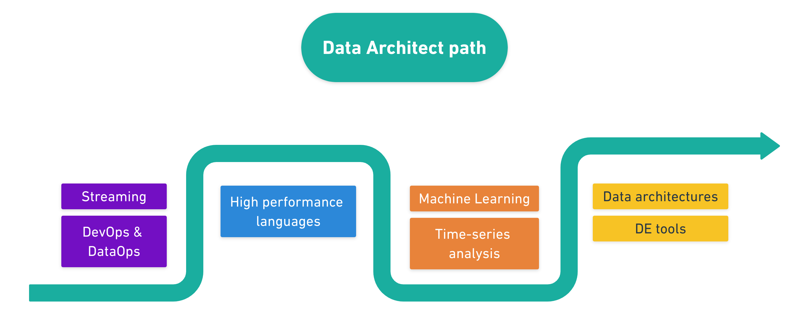

# Data Engineering roadmap

In [previous chapter](1.1-what-is-data-engineering.md) we learned that data engineers work on delivering good data services. To build such services you will need to learn a lot because such job requires many cross-discipline knowledge.

To master Data Engineering you need to learn many areas of Computer Science, from programming and hardware to the specific domain knowledge. But fear not, you don't have to learn all the concepts of the profession at once. 

I like the lean approach to learn Data Engineering. In this roadmap I'll show you a way to level up gradually so you don't feel overwhelmed.

Let's talk about areas of expertise. A good Data Engineer should be proficient in the following:

- **Software Development** – you need to know how to write good software
- **Tech Stack** – to understand and develop a good infrastructure
- **Analytics** – to speak the same language with analysts and the business
- **Domain Knowledge** – best practices of data engineering

# Three paths of Data Engineering

I like to split the roadmap into three path (or tiers): beginner, Big Data and Data Architect.

This split is not a golden rule, but rather observation of the market. Those tiers are based on the job descriptions I've analyzed. For example, some DE positions require knowledge of databases, but not require knowledge of Big Data stack. Thus, such skills could be separated to different tiers.

On the other hand, you may think of those tiers as a layered pie: every new level should be on top the previous.

Let's look closely at each path.

## Beginner path

When you only want to start DE career you need to work on some fundamental skill-sets.

Beginner path is all about data engineering basics. Here you need to gain a good understanding of SQL and relational databases, some programming experience (most likely in Python), basics of analytics and data engineering concepts.

Knowledge of the beginner level should guarantee you a job on Junior or Middle data engineering positions. After completing this level you will be able to communicate with databases, create data pipelines, model data for data warehouses and even visualize that data in BI tools.

## Big Data path

Big Data path is a continuation of the beginner with strong shift towards Big Data technologies. Probably it will take x2-x3 times more to master this path. 

You should learn about Big Data stack, distributed processing, advanced programming, containerization, clouds, statistics, and continue with the most important data engineering concepts, like data quality and data security. 

With knowledge of such level you are able to cover most of Senior Data Engineer requirements.

## Data Architect path

Data Architect path is a High League. People with such knowledge have a broad understanding of all Data Engineering concepts. 

On this level you are not only able to create reliable data pipelines, but also decide the architecture decisions and pick the most suitable solution for each use case in Data world. You will need to learn some advanced technologies like streaming and DevOps, learn more programming languages (like Java, Scala and Go), have hand-on experience with ML-engineering, and so on.

## Table of skills

For convenience, I combined all skills and paths into one big table. Come back to this tables once you feel that you need inspiration about "what to learn next?".

<table>
  <tr>
    <th></th>
    <th>Beginner path</th>
    <th>Big Data path</th>
    <th>Data Architect path</th>
  </tr>
  <tr>
    <td><b>Software engineering</b></td>
    <td>
        <ul>
            <li>SQL</li>
            <li>Version control</li>
            <li>Python</li>
            <li>Web</li>
        </ul>
    </td>
    <td>
        <ul>
            <li>Advanced programming</li>
            <li>Advanced Python</li>
        </ul>
    </td>
    <td>
        <ul>
            <li>High performance languages</li>
        </ul>
    </td>
  </tr>
  <tr>
    <td><b>Tech Stack</b></td>
    <td>
        <ul>
            <li>Databases</li>
            <li>Relational and non-relational databases</li>
        </ul>
    </td>
    <td>
        <ul>
            <li>Linux</li>
            <li>Docker</li>
            <li>Clouds</li>
            <li>Distributed processing</li>
            <li>Hadoop stack</li>
        </ul>
    </td>
    <td>
        <ul>
            <li>Streaming</li>
            <li>Operations (DevOps, DataOps)</li>
        </ul>
    </td>
  </tr>
  <tr>
    <td><b>Analytics</b></td>
    <td>
        <ul>
            <li>BI tools</li>
            <li>Business Metrics</li>
        </ul>
    </td>
    <td>
        <ul>
            <li>Statistics</li>
            <li>A/B testing</li>
        </ul>
    </td>
    <td>
        <ul>
            <li>Machine learning</li>
            <li>Time series analysis</li>
        </ul>
    </td>
  </tr>
  <tr>
    <td><b>Domain knowledge</b></td>
    <td>
        <ul>
            <li>Data modeling</li>
            <li>Data pipelines</li>
        </ul>
    </td>
    <td>
        <ul>
            <li>Data quality</li>
            <li>Security and privacy</li>
        </ul>
    </td>
    <td>
        <ul>
            <li>Data architectures</li>
            <li>DE tools landscape</li>
        </ul>
    </td>
  </tr>
</table>

# Summary

Data Engineering is a fast developing field and changes rapidly. New technologies emerge every day. That is why my roadmap focuses more on core skills rather than particular technologies.

Good luck with your journey!
