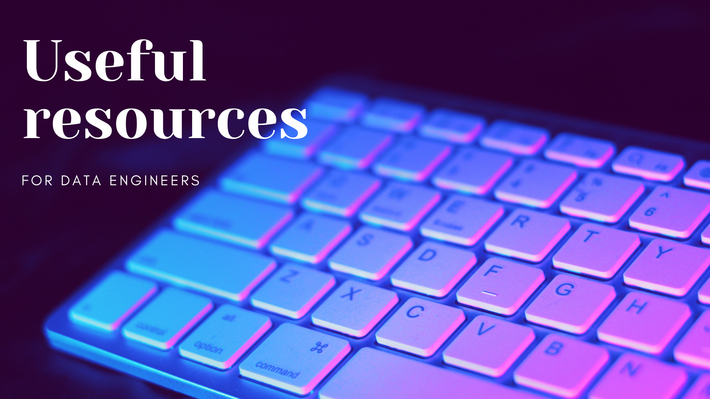

# Useful resources for Data Engineers

Being a good specialist means that you need to be familiar with the latest trends in your field of work. Especially if we are talking about Data Engineering and Data Science, those fields are changing rapidly nowadays.

In this article I collected a list of handpicked resources I'm following in order keep up with the pace.

## Newsletters

Newsletters are a great way of being informed about news without spending too much time.

 
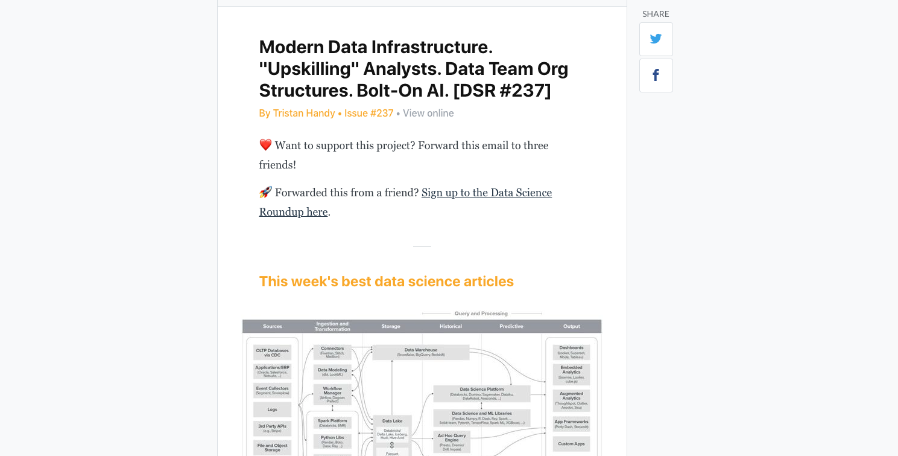

First very nice newsletter is [**The Data Science Roundup**](http://roundup.fishtownanalytics.com) by [Tristan Handy](https://twitter.com/jthandy), founder **Fishtown Analytics** and **dbt** tool . "The internet's most useful data science articles". One of my favorite resource from all presented here. Tristan share a couple of useful links each week on data science and data engineering topics.

 
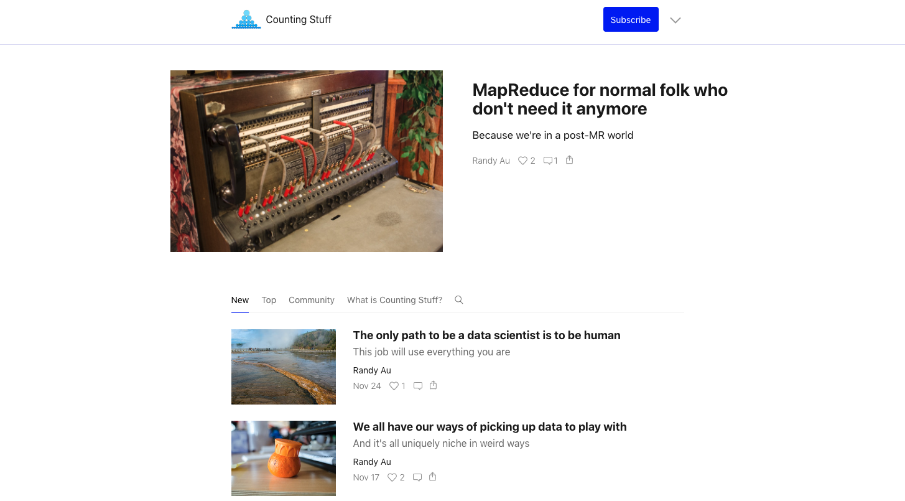

Second newsletter is [**Counting Stuff**](https://counting.substack.com/) by [Randy Au](https://twitter.com/Randy_Au). Randy writes his own thoughts on different aspects of data. Sometimes emails are more technical, sometimes less. But overall it gives me a lot of food for thoughts.

 
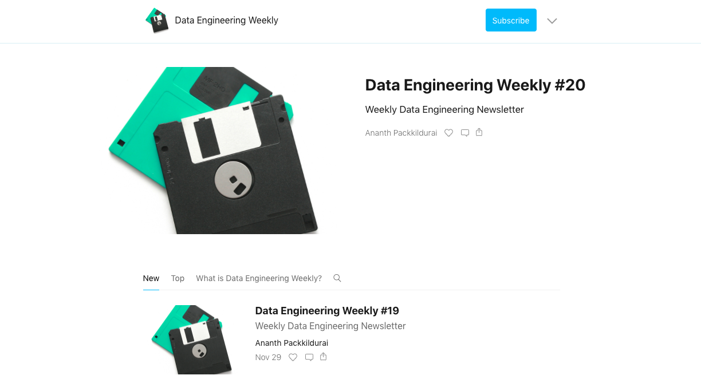

[**Data Engineering Weekly**](https://www.dataengineeringweekly.com/) by [Ananth Packkildurai](https://twitter.com/ananthdurai). Relatively new newsletter, started in July 2020.

Ananth shares a lot of high quality links about different aspects of data engineering. What I like most about this newsletter is that it covers not only technical topics, like tools or technologies, but also some higher level topics like data quality, data discovery, etc.

 
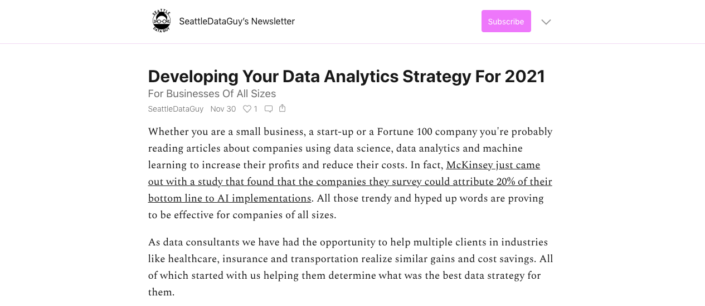

[**Seattle Data Guy**](https://seattledataguy.substack.com/) by [Benjamin Rogojan](https://twitter.com/SeattleDataGuy). This newsletter takes another approach to content. Each issue is a separate story where author shares his ideas about the topic. Just look at this one about [Data Strategy for 2021](https://seattledataguy.substack.com/p/developing-your-data-analytics-strategy) or this one about [ETL](https://seattledataguy.substack.com/p/what-are-etls-and-why-we-use-them).

 
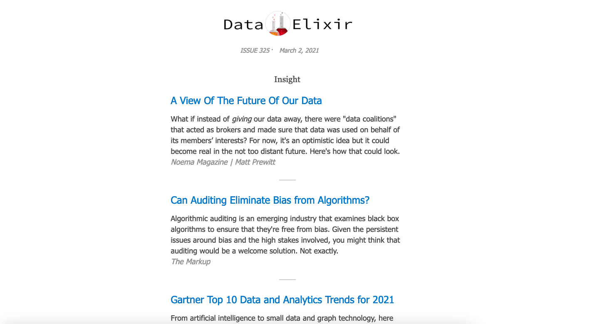

Another gem is [DataElixir newsletter](https://dataelixir.com/newsletters/). Covers a lot of data topics, from Data Science to Data Engineering. Absolutely recommend to stay on the edge of latest news in data.

## Blogs

Blogs require more time to spend on them, but overall they give you more detailed information and even step-by-step guides.

 
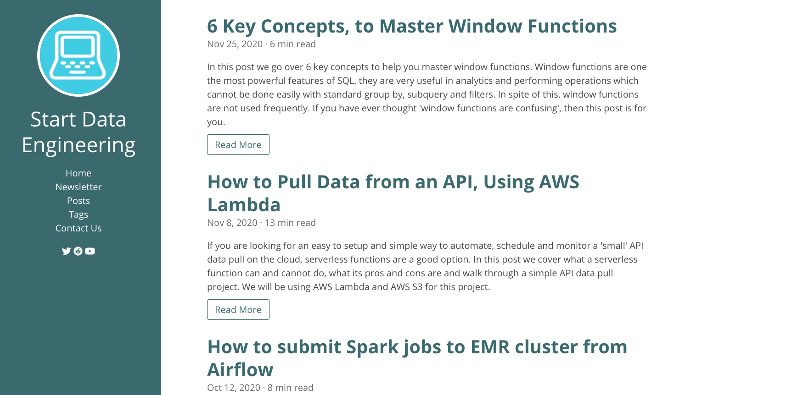

[**Start Data Engineering**](https://www.startdataengineering.com/) is a relatively new blog, but provides very quality content. You can read about some high-level topics like [What is a Data Warehouse](https://www.startdataengineering.com/post/what-is-a-data-warehouse/) or [Why to use Staging](https://www.startdataengineering.com/post/what-and-why-staging/) as well as about more practice-oriented tutorials like [How to pull data from API using AWS Lambda](startdataengineering.com/post/pull-data-from-api-using-lambda-s3/).

 
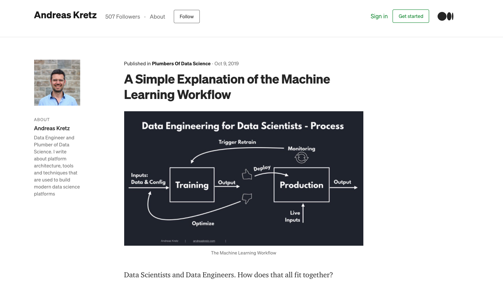

**Andreas Kretz** is a data engineer from Germany who posts on [Medium](https://medium.com/@andreaskayy), writes his own [Data Engineering book](https://github.com/andkret/Cookbook) and have a [YouTube channel](https://www.youtube.com/channel/UCY8mzqqGwl5_bTpBY9qLMAA). Talk about different topics of DE and DS.

 
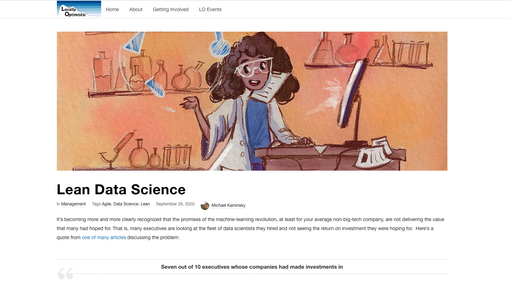

[**Locally Optimistic**](https://locallyoptimistic.com/) writes about many aspects of data, including data engineering. Overall a good resource to rest from strictly technical articles and switch to soft-skill and more philosophical topics.

 

My recent finding is [Alisa in Techland](https://www.alisa-in.tech) blog. Alisa has some nice in-depth articles about Data Engineering. Her motto is "I believe that data engineering can and should be more approachable". And I can't agree more :)

Lastly, pay attention to the blogs of **some tech companies**. Don't hesitate to check them all:
- [StitchFix Multithreaded](https://multithreaded.stitchfix.com/blog/)
- [Netflix](https://netflixtechblog.com/) tech blog
- [Shopify.engineering](https://shopify.engineering/)
- [Airbnb Engineering & Data Science](https://medium.com/airbnb-engineering)
- [Uber Engineering](https://eng.uber.com/)

## Videos

Here I will recommend some YouTube channels worth checking. Some of them are pure experience, some are nice guides and tutorials.

 
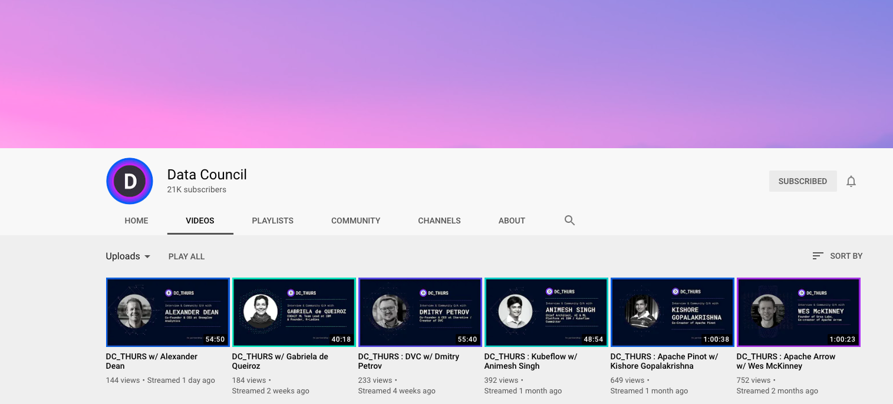

[**Data Council**](https://www.youtube.com/channel/UCAezwIIm1SfsqdmbQI-65pA) has "the best data-oriented tech talks from the top engineers from top technology companies across the world". The content sometimes "heavy" for beginners, but more seasoned developers with find it very useful.

 
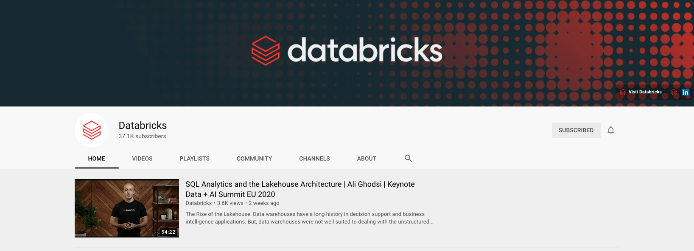

[**Databricks**](https://www.youtube.com/channel/UC3q8O3Bh2Le8Rj1-Q-_UUbA) is a company behind Apache Spark computing framework and some other data-related technologies. The channel has many videos about Big Data, Machine Learning and AI. Their headline conference "**Data + AI summer 2020**" was purely online so you can check a lot of good talks from smartest people. Must see if you like to know more about Hadoop technilogies.

 
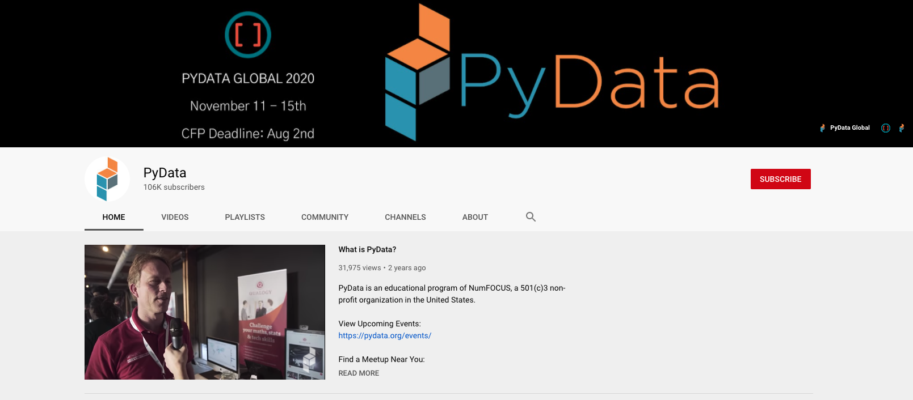

**PyCon** and **PyData** are two conferences about Python programming language. First one is more about engineering, second has a strong data shift.

PyCon has no dedicated channel, each edition of the conference lives on a separate channels, for example:
- [PyCon 2020](https://www.youtube.com/c/PyCon2020)
- [PyCon 2019](https://www.youtube.com/c/pycon2019)
- or just search "pycon" in Youtube

For PyData there is a dedicated channel [here](https://www.youtube.com/user/PyDataTV).

## Podcasts

Sometimes you don't have possibility to read something, or you want to take a break from the monitor. For you I have another medium – podcasts :)

 
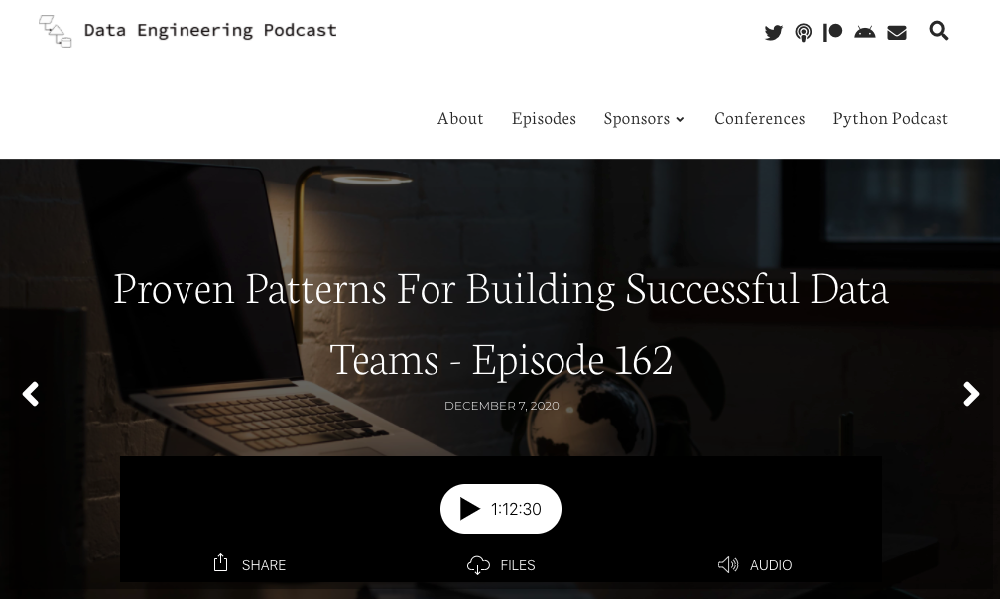

[**Data Engineering Podcast**](https://www.dataengineeringpodcast.com/). Discussions about various data-related topics with interesting guests.

 
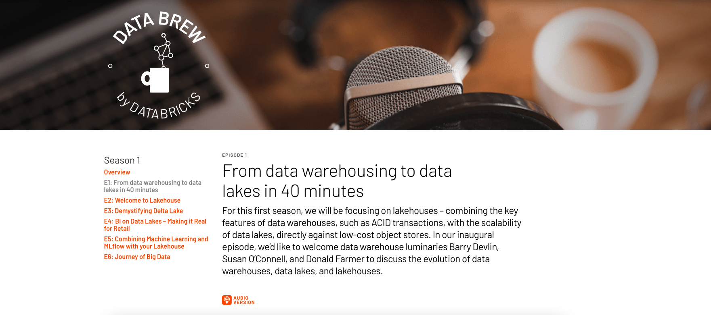

Databricks started its own video-podcast called [Data Brew](https://databricks.com/discover/data-brew/s1-e1-data-warehousing-to-data-lakes). So far, covered topics include Data lakes, Delta lakes, BI on Delta lakes and Spark (basically everything that Databricks is working on). So if you are a Big Data engineer you definitely find those podcasts useful.
 

## Awesome lists

Lastly, when you want to discover something new, unexpected or inspirational, try some of the **Awesome** lists below:

 

- [Awesome Data Engineering](https://github.com/igorbarinov/awesome-data-engineering)
- [Awesome Business Intelligence](https://github.com/thenaturalist/awesome-business-intelligence)
- [Data Engineering How-to](https://github.com/adilkhash/Data-Engineering-HowTo)
- [Awesome Open-source Data Engineering](https://github.com/gunnarmorling/awesome-opensource-data-engineering)
- [Awesome Data Engineering Path](https://awesomedataengineering.com/). Learning path and resources to become a data engineer
