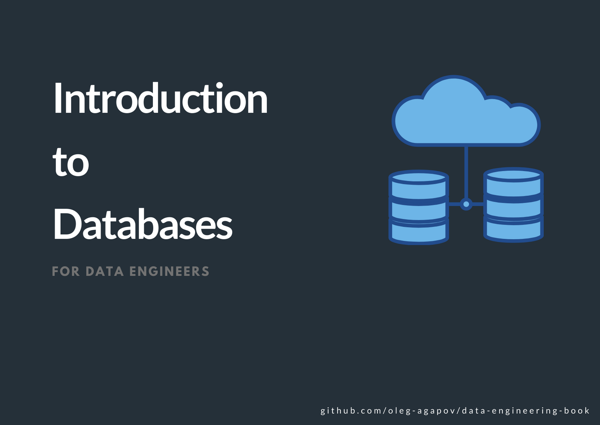

# Introduction to databases

## Foreword

In this chapter we are going to talk about **databases**. Let's discuss the application of databases, obstacles you may have while working with them and important aspects you should know as a data engineer.

It is probably impossible to know all _aspects of databases_, but as a technical specialist you need to know about their existence. It is especially important to know database theory in cases of specific problems. Broad knowledge will give you an advantage when solving such problems.

The following _questions_ may appear while working with databases:
- Which database is the best for my data?
- Do I store my data in an efficient way?
- Is my database fast? 
- Do we use an optimal configuration?
- and so on

## Data and ways to store it

What is **data**?

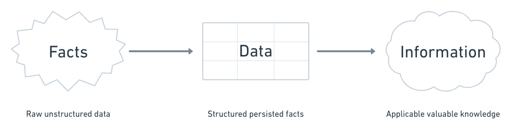

We have a lot of facts and logs around us. But they are useless if we don't gather them. So, we need to somehow capture them, apply some structure and save them. Let's call **structured persisted facts** a _data_.

Furthermore, let's call the place where we store our data a **database** (or DB for short). For any database we have a list of requirements:
- we should be able to save new data to DB
- to read saved data back
- delete and change saved data
- analyze saved data

To help us with such requirements each database has a **DataBase Management System** (or DBMS). This is a system which "runs" the database and gives us tools to work with it.

Now, having full control of our data we can transform it into **information**. Such information can be translated into some **knowledge** and subsequently into **value** for the company (though gaining insights and increasing company's profit).

## Types of databases

There are many types of databases exists. Each type helps to solve some particular problem with the type of data they deal with.

On a very high level, there are two major types of databases: **relational** and **non-relational**.

**Relational databases** are databases which use relational model of data and were invented in 1970th. They use **relational database management systems** (RDBMS) to maintain a database and support (most of them) **SQL** (Structured Query Language) for managing data.

In contrast, **non-relational databases** don't follow relational model (though they may use some parts of it) and have a special internal representation of the data. Because of variety of ways of storing the data, there is a variety of non-relational databases categories. Some of them we will discuss later in the chapter.

### Why not store data in files?

Before going any further, let's briefly answer a simple question: why not store our data in files instead of a database?

Main reason of choosing a database over simple files is the **complexity** of such solution. From the first sight it seems that working with files is not a big deal, just write row-by-row to some file and the job is done. 

But if you explore more, you will find a lot of issues with files:

1. Files usually have very little or no **metadata** (or data about the data). And each user of this file will have to deal with understanding of what is going on inside the file.
2. Many clients will require **parallel read/write**. It is hard to achieve with files.
3. **Changing the structure** of the data is a pain. You may break back-compatibility with older versions of the clients. For example, will your application work correctly if you change a data type of some field?
4. **Access and searching** problems. Random access is a requirement when you need to find and read/change/delete some specific part of the data (for example information about a customer). A search will be very slow and inefficient with files.

There are cases when _files could be a way_ of storing data (for example in architectures called [Data Lake](https://en.wikipedia.org/wiki/Data_lake)). But in most cases, standard databases will be used.

## Relational model

Now let's talk how to structure our data.

First very obvious data structure is a relational model. It represents data as **tables** and **relations** among those tables.

Every row in the table called a **record**, every column is called a **field**.


Now let's discuss a bit how we can fit out data in the relational model. And I'd like to start from the example. Imagine that you have an online electronics store and you are saving every purchase to the table called "Purchase log". You want to store the purchase date, customer's name, purchased products and total price. Suppose you have an Excel file with such information:

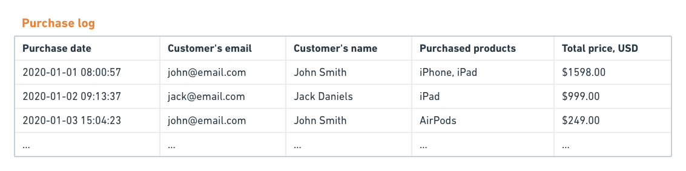

There are a few problems with such representation:
1. **problems with updating the data**. For example, is customer John Smith will want to change his email, you will have to find and replace all occurrences of existing email and replace with a new value. It is probably not a problem if you have 1,000 rows, but what if you have 10 millions?
2. **problems with extracting the data**. First order in the table has two items in the cart and its total price. From such information it is not clear what is the price of _each item_, was any item purchased _with discount_, no easy way to count _total number of items_ in the cart, etc.
3. **problems with removing data**. Once again let's consider first order with two items. What if customer decided to return one item, what should we do? Remove it from the first row? Or implement a special status with a new row for refunded products?

All such problems appear because such representation of the data is called **denormalized**. It is a very essential structure for humans: easy to read, every field has descriptive names, orders are sorted in time, every row has full information about the order, etc. But it is not efficient for computers :
- data is duplicated
- some of the fields (for example user's name) are not (much) relevant to the purchase log
- it may be slow to find/change/remove needed data if the log is pretty long

That's why in relational databases we store data in a **normalized form**.

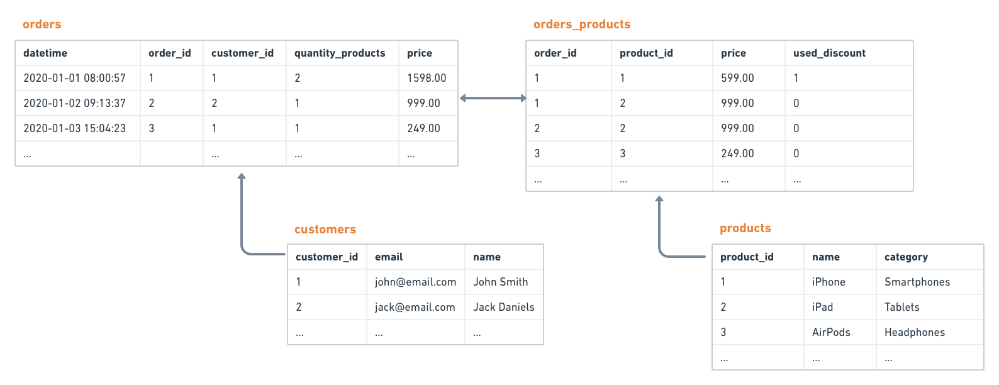

Normalization helps us:
1. **Simplify** the data structure - by splitting the data into smaller parts we now can easily see how those parts are combined into a bigger system
2. **Reduce errors** - during write we lookup into relations and can spot an error during writing
3. **Reduce redundancy** of the data
4. **Reduce the DB size**
5. Enforce **data consistency** via relations

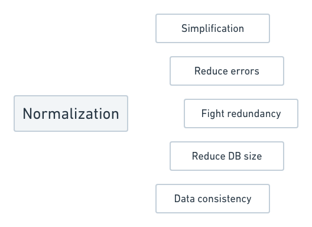

In our example, new structure gives us a few perks:
1. we now have constrains about the data structure (enforce data simplification and quality)
2. we can have purchases only from existing users and for existing products (enforce data consistency)
3. fact table (in our case `purchases`) have only links to other tables, but not the values of this data (reducing the amount of stored data)
4. if we want to add new purchase we create a record in `purchases` table and do not touch other tables; if we want to update customer's info we update it in `customers` tables and do not touch other tables (easier to maintain)

### Normalization tips

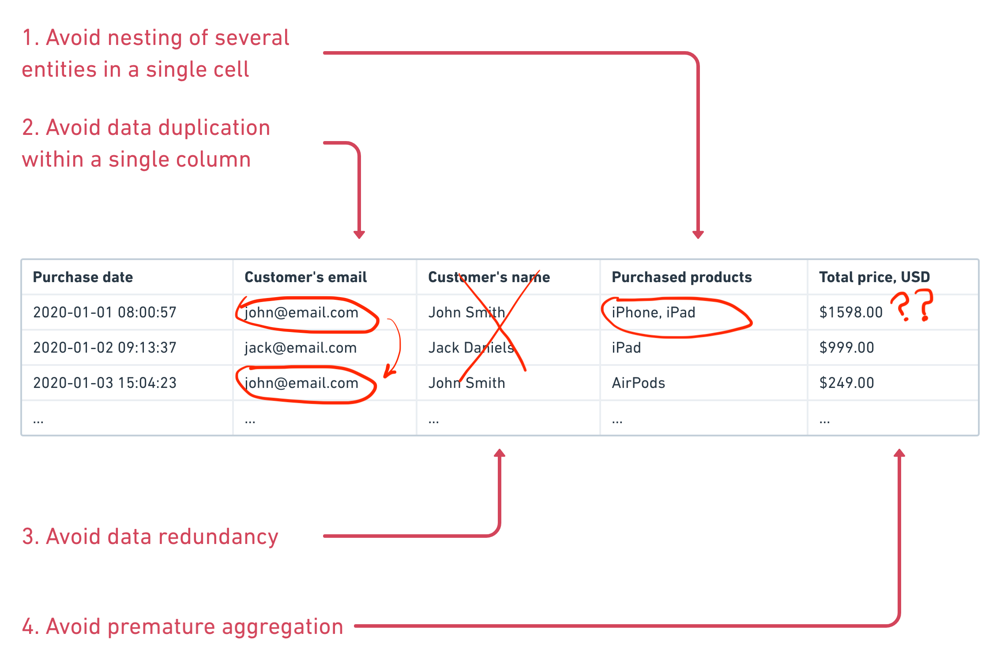

It is worth mentioning that there are a lot of [levels of normalization](https://en.wikipedia.org/wiki/Database_normalization). I'm leaving exploring the differences to the reader, but will give you a few tips how to normalize denormalized table:
1. **Avoid nesting of several entities in a single cell** (e.g. Purchased products in my example). Can be fixed by implementing external table with relations.
2. **Avoid data duplication within a single column**. Can be fixed by extracting such data to another table and referencing it in original table (in the next section we will talk about external keys).
3. **Avoid data redundancy**. Drop all the fields which can be obtained through connected table. For example, customer's email and name are redundant fields in Purchases table if this table has `customer_id` reference to Customers table.
4. **Avoid premature aggregation**. For example, in my example I had Total price column, which is a sum of all items in the cart. Can be fixed by dividing your data into atomic (non-distinguishable) states, in my case by introducing orders_products table.

## Keys and indexes

### Primary and foreign keys

In relational model any table should have a **primary key**. This is needed to create **relations**. Of course, this rule can be skipped if a table does not have relations with other tables.

In its simplest form, _primary key_ is **unique, usually increasing sequence of numbers**. For example, `customer_id` is a primary key for `customers` table.

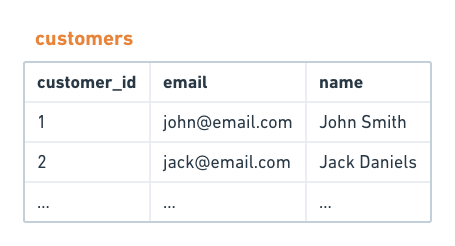

Now, for table `orders`, field `customer_id` becomes a **foreign key**, because it is references a primary key from another table (in our case `customers`).


Make a note that those fields in two tables don't have to be named the same. For example, as usual primary key is named simply as `id`, and for foreign key is `external_table_name + id` (e.g. `customer_id`).

### Indexes

When you want to find some record(s) in the table, DB needs to scan through all its values in order to find row(s) matching your criteria. Of course, the more records you have in your table, the more time it is needed to scan through all of them to find what you are looking for.

**Index** is a solution which allows us to quickly search through the table rows with provided conditions.

The closest example of an index from real-life is _indexes in a book_. There index is a list of words or phrases and their associated locations. In order to find needed term you can either leaf through all pages until you find it or or open an index and find needed page immediately.

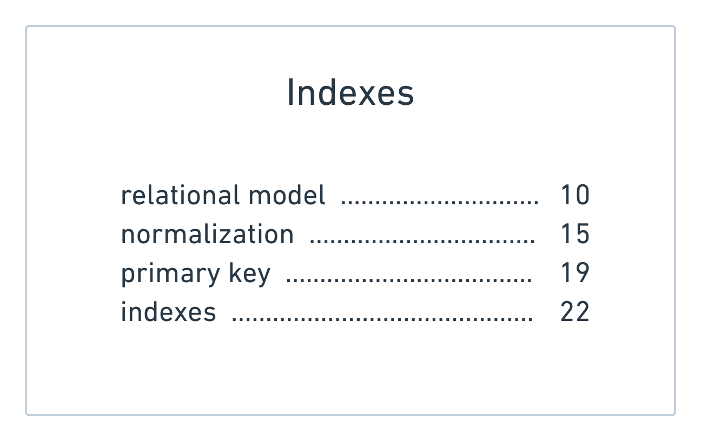

Indexes in databases work in a very similar fashion.

**Index for a table is kind of a separated entity**. The table with original data does not depend on its index, actually it is the other way around, index depends on the content of your table. You can create, delete and re-create index for the table. Index is a separate table with keys (which are based on columns content) and pointers to those keys in data table.

Indexes can be created for any field of your table and they are based on a column's content. Each time you make a search using an indexed field, database will first search through the index structure, and after it will perform a look-up in the table itself.

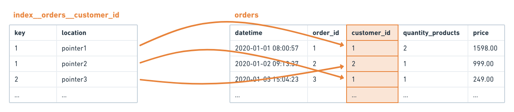

Indexes in databases are saved in a form of a **b-tree structure**. B-tree is a sorting algorithm allowing you quickly search through a set of values. You don't need to understand at this point how this algorithm is working, it's not a point of this chapter. But you need to understand the capabilities this structure is giving to you. You can easily search for a single value, a range of values, min and max values, achieve quick sorting.


One might say "hey, if index allows us quick search, why not build an index for _every column_ in the table"? While tempting, it won't give you a performance gain because each time you add new values to you table you need to re-calculate the index (it's a tree, remember?). In the end, re-calculating indexes will take a lot of time so you will end-up with performance degradation.

**Primary key is usually indexed by default**. This allows you not only have a unique key for your records, but also for quick search using it.

Every database has it's own implementation of indexes, so make sure you read the documentation for you DB if you want to achieve maximum efficiency with your queries.

Read more about indexes [here](https://www.startdataengineering.com/post/what-does-it-mean-for-a-column-to-be-indexed/) and on [Wikipedia](https://en.wikipedia.org/wiki/B-tree).

### Gotchas


When using indexes pay attention to the following:
- **overhead** for supporting indexes (when you insert a lot of data)
- make sure your indexed data has **high cardinality** (it means the following: the more distinct values your column has, the more efficient index is; it won't be efficient if you have only binary True/False values, for example)
- if you do a lot of deletions your index become **fragmented** (empty leafs) causing inefficiency
- when creating index, pay attention to **most common queries** you are going to perform on your table, and according to that knowledge build indexes

### Execution plan

When you submit a query, it goes not directly to database, but rather to a layer called **query planner**. The query planner has a table of costs for each operation, in other words "_how costly it will be to use this or that operation_". So it takes your query, looks inside and check what tables and fields you want to use. Based on this information it builds several plans of execution, and then check their "costs". Most of the databases have commands `EXPLAIN` and `EXPLAIN ANALYZE`. They will show you how DB will perform your query.

```
-> EXPLAIN SELECT * FROM orders WHERE id > 100
-> UNION 
-> SELECT * FROM refunds WHERE id <> 100
+----+------------+------------------+----------+-----+-------------+-------+-------+----+--------+--------+---------------+
|id  |select_type |table             |partitions|type |possible_keys|key    |key_len|ref |rows    |filtered|Extra          |
+----+------------+------------------+----------+-----+-------------+-------+-------+----+--------+--------+---------------+
|1   |PRIMARY     |orders            |NULL      |range|PRIMARY      |PRIMARY|8      |NULL|235     |100     |Using where    |
|2   |UNION       |redunds           |NULL      |range|PRIMARY      |PRIMARY|8      |NULL|52      |100     |Using where    |
|NULL|UNION RESULT|<union1,2>        |NULL      |ALL  |NULL         |NULL   |NULL   |NULL|NULL    |NULL    |Using temporary|
+----+------------+------------------+----------+-----+-------------+-------+-------+----+--------+--------+---------------+
```
(example output of EXPLAIN command in MySQL)

## Denormalization

When we talked about relational model we discussed _data normalization_. It is a process of decomposing your data into smaller parts. This model is efficient for storage and convenient for querying, but sometimes it it too granular. Sometimes we want our data to be **aggregated** to some level. Let's consider one example.


Let's say we want to show to every customer a short summary of all purchases made by this customer, meaning the number of orders and total price. It could be a tedious task if we would need to calculate this data each time we need to show it. Because each time we will need to query our orders log, which may contain millions of records, and thousands of users could request this data simultaneously. Such requests will have a big influence to our DB. Wouldn't it be convenient to aggregate this data for each user and query this table instead?. This way we will save some querying time (because now we need to retrieve only one record from this table) and not overload our DB.

Such process is called **denormalization**.

What are pros of denormalization:
- **speed** up some frequently performed queries
- **simplification** of querying such data

Cons of denormalization:
- it could be **costly to update** such data (create/update)
- **complexity** of the initial query is not gone, we still need to create and support creation script
- such complexity **can be error prone**
- data should be **normalized first** (check the structure, add indexes)
- may be an **overkill** if the cost is low (use EXPLAIN to find out)

As always, try to look at real-world use cases of your tables (frequently used queries) to understand the **pattern** and implement the best possible structure of denormalized data.

## Transactions

Term **transaction** in databases world usually means an **indivisible unit of work**. Most common use-case is when we need to perform a several operations in our DB and we want to make sure that either all operations are succeeded or failed and not executed at all.

There are two classical examples of transactions in databases.

**Example 1**. **Imagine that you need to transfer money from one bank account to another.** 

There are several steps to be made:

1. Check that requested amount exists on account 1
2. Subtract that amount from account 1
3. Add needed amount to account 2
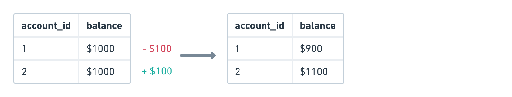

4. Possibly, add this transfer to `transactions` table
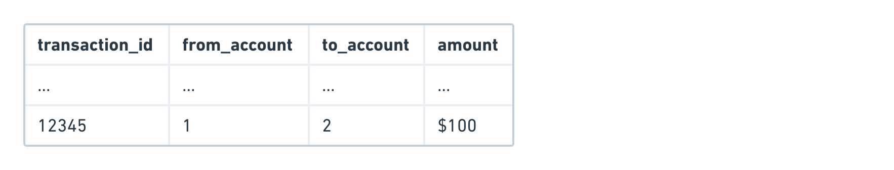

Now imagine that any of the described steps fails to execute:

1. When checking the balance you need to be 100% sure that no other operation is pending, so once you start transfer, DB will have the needed amount.

2. After successful operation of subtracting $100 from account 1 you need to be sure that it will be added to account 2. Otherwise, these $100 will be lost.

3. If DB will fail to add new record to `transactions` table you probably have no ways of proving that those $100 were deducted from account 1 and not from any other.

As you see, either **all operation are executed successfully** or not executed at all.

**Example 2**. **Archiving part of the table.**

Imagine that you have a table `messages` that stores chats between your users. At some point the table appeared to be so big, that it become very slow to manipulate with. Luckily, you have a policy saying that you can archive all messages older than 1 year. So you decided to copy old records to a new table called `messages_archive`.

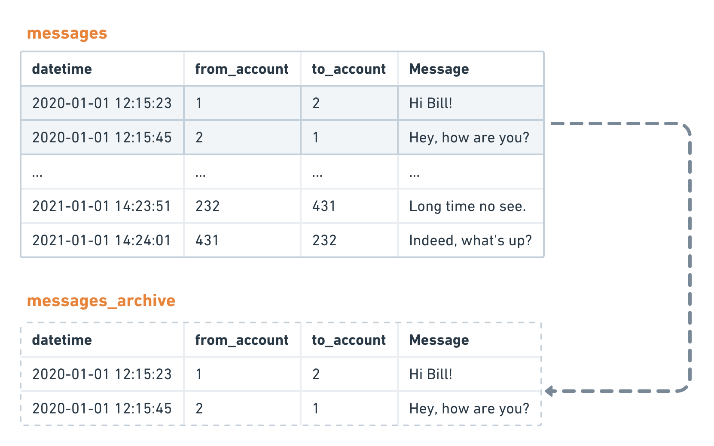

Here we have two step process:
1. copy needed data to new table
2. delete the data from original table

Both operation should be executed as a part of a single transaction, otherwise we will have either data duplication or data lost.

### Conflicts in databases

Curious minds could ask a simple question: **why we need transactions**, why not just run all transformations one-by-one? Because, in the end, it is what database will do eventually.

You have a point, but you should alway consider two types of problems with databases
1. software or hardware outage (electricity may go down, network issues)
2. DB works with many users at the same time (simultaneously read, update or delete the same data)

Any of the problem above will create a **conflict** in database.

Recall the example with transferring money between accounts. What will happen if database will deduct money from account #1 and electricity outage happens on the server? Those money will be subtracted and "lost", because DB won't remember that it has to add them to account #2. If we would do it as atomic (separate) operations, we will have conflict.

Or let's consider an example with cinema ticket booking. Imagine that you book a seat in movie theater. And some other user wants to book the very same seat. Who will own the seat in the end? It will be hard to say without transactions, because the moment of saving the data will be random and not controlled by the application. With transaction control it will be much predictable.

### Transaction control

How transactions are handled internally?

DB writes all changes to a special _journal_. But it doesn't perform execution of transaction steps immediately. All changes are applied only in case when **transaction commit** is happening. This way we have a guarantee that all operation will be executed as a whole.

From developer's point of view, one way to implement transaction is using **stored procedure**. It is a special program written by the developer and stored inside the DB. Such programs usually have a _try/catch_ workflow:
- sequence of transaction operations usually put to `TRY` block
- and `CATCH` block will include the code to handle the errors

When such procedure is called (executed) it tries to run the code in TRY block and in case of failures will execute CATCH block. 

To ensure that the code in TRY block is executed exactly as transaction, all operations within are wrapped in `BEGIN TRANSACTION` and `COMMIT TRANSACTION` keywords, and `ROLLBACK TRANSACTION` keywords are going to CATCH block. So if everything went well in TRY block, all operations will be committed to the database, otherwise the transaction will be rolled back (meaning any partial changes will be undone).

Of course, exact implementation of stored procedures may vary depending on the database, but general idea should be stay the same.

Also, many databases have APIs to perform transaction operation in a language of your choice (Python, Java, etc). There you will have a granular control over your transaction and you decide on the workflow (when to commit, when to rollback, etc).

### ACID

Transaction in DB are possibly when a DB comply with 4 requirements:

- `A` - atomicity
- `C` - consistency
- `I` - isolation
- `D` - durability

Let's discuss those requirements in details.

**Atomicity** means that the operation (unit of work) you are performing will be fully executed. All changes to the data must be performed successfully or not performed at all.

**Consistency** is more of a business logic which software engineers should follow. For example, when we subtracted X amount of money from account #1, we need to make sure that we are adding the same X amount to account #2, otherwise the total balance will be different after the transaction commit, so we loose consistency in data. More generally, the data should be in a consistent state before and after the transaction.

Don't confuse it with **integrity error** (for example when you are trying to insert a row with non-existent `id` key).

**Isolation** should give us some predictable results when several actions are happening in parallel on the same data. Simply put, no other process or request can change the data while the transaction is still in progress. Consider the example with simultaneous purchasing of tickets: no other user can book your seat if you already started booking process.

**Durability** guarantees that returned result of the operation (e.g. user got a successful response about funds transfer) is persisted in DB and won't be lost.

Most frequent errors happening when working with transactions are:
- **lost update** – when some data from user #1 gets overwritten with the data from user #2 (example with booking tickets). Happens when we didn't block the data during the commit, so we got overwritten data
- **dirty read** – when user #2 see some temporary changes from user #1, but such changes are not final (potentially, rollback could be applied in the end by user #1)
- **non-repeatable read** – happens when user #1 performs a long operation (e.g. calculate some statistics), but user #2 makes some changes to the data, read by user #1
- **phantom read** – similar to previous point, but user #2 delete some of the data, while user #1 makes some operation with it


To solve such problems, databases have 4 **level of isolations**:
1. The lowest level of isolation is called **read uncommitted**. In practice used very rarely, mostly for debugging purposes. It allows to perform queries to non-committed transactions. Conflicted transactions are applied sequentially, not causing a lock of the data. 
2. **Read committed** level. Used by default in majority of relational databases. Ensures that user will never perform dirty reads. Two conflicting transactions never see the intermediate steps of each other. This level is useful for short transactions.
3. **Repeatable read** secure us from long updates, dirty reads and non-repeatable reads problems. This level "freezes" the state of the table during such read and work with a snapshot of the data. Cons here is that we block our data in this mode, so less users can work with our DB simultaneously. Only edge case here - it is possibly to add new records to such blocked table. And if they satisfy the criteria of our query, they will be accessible and returned.
4. **Serialization mode**. Secure us from all 4 types of errors. This mode fully block the table for any transactions (create, update, delete). Make sense for analytical queries where precise of the result is expected. All transactions work in sequential mode, _one after another_. It is the highest level of isolation, which guarantee high precision, but in general slows down the performance of the DB and parallelization (number of users working with the DB at the same time).

### Summary

Transactions are:
- a great way to have a full control of your data
- implemented on a DB level
- help you overcome some of the conflicts which may occur during CRUD (Create Read Update Delete) operations
- add durability to you DB

But you always need to remember about _accessibility / consistency_ tradeoff:
- Higher _accessibility_ may lead to inconsistent data. Makes sense if your system requires fast commits, but allow small inconsistencies during the read
- Higher _consistency_ may lead to performance drop. Makes sense if your system need a guarantee of data consistency, for example for a banking sector

## Replication

How safe is storing only a _single copy_ of the data?

What if our DB is experiencing a downtime (for example because of lack of network connection) while many clients are trying to reach it to get some data? In such a case our applications won't have any data available.

And what if our server node with DB crashes completely? We will loose our data. Of course, if we have backups we can restore it, but we will still have a downtime.

**Replication** can help us with those issues.

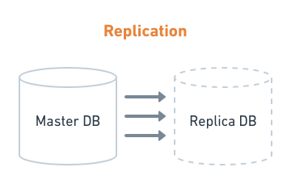

**Replication** is a duplication of our database to different nodes/servers.

What replication gives to us:
- replica is a full copy of all data in DB
- if our main node is unavailable for any reason, we can redirect all incoming requests to replicated node
- we can spread our replicas into different geo regions (countries, continents), so we could give our users faster responses
- very often it is used for load balancing, because different queries could be sent to different nodes with replicas

Very often you may hear two modes in which databases are operating: OLTP and OLAP.

**OLTP** stands for On-Line Transaction Processing.

**OLAP** stands for On-line Analytical Processing.

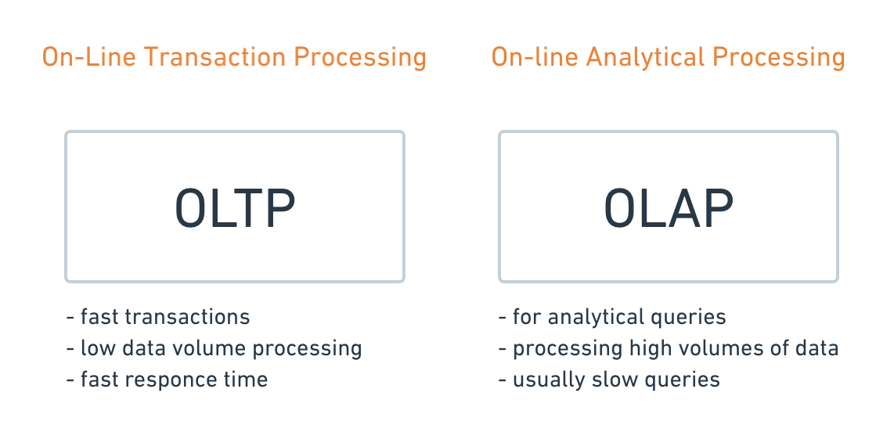

OLTP mode works with fast transactional operations. Every transaction (no matter read, write or update) is happening very fast. The amount of data involved is also minimal, queries are usually pretty simple. Every operational DB should work in OLTP mode to ensure fast response time.

OLAP mode is used in Analytics. Queries here are slow, involves massive amount of data and complex queries. During processing of long queries, DB lock all transactions until the query is in progress. Data Warehouses usually work in OLAP mode.

There could be a use case, when main DB is working in OLTP mode (to ensure non-blocking operations in production), but its replica in OLAP (so it could be used for analytical purposes).

### Architectures

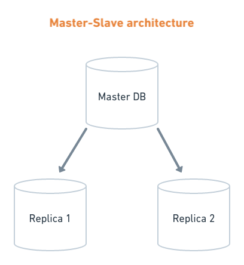

Architecture with replicas usually follows **Master-Slave architecture**. It means that there is a **master node** and one or several **slave node(s)** (sometimes called _replicas_ or _followers_).

In such architecture, all applications are communicating with master node, all transactions are happening on this node. This node write all changes to the journal and send this journal to all slave nodes. Slave nodes don't accept changes from users, but only from master (in a form of a journal). After receiving the journal, slaves apply changes from it and get the same state as master has.

There are two ways of communication between master and slave: synchronous and asynchronous.

In **synchronous** mode, when master send the journal, it waits for the response from slave, and only after that send the result back to user.

In **asynchronous** mode, master doesn't wait for response from slave and immediately send the result back to user.

### Several examples of architectures

#### Example 1

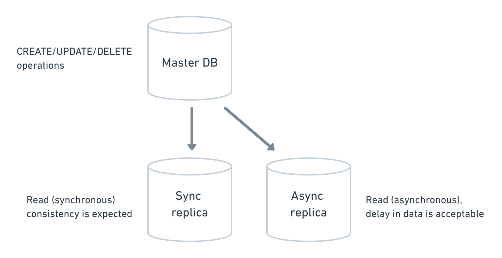

Combining all the above, we could have the following architecture of our DB cluster:
- All create/update/delete operations are performed on master node.
- All reads are performed from a synchronous replica. Of course, synchronous slave could have some delays, pay attention to this fact.
- If read operations are not critical for your application, and you can accept delays, you could even make reads from async slaves. This will improve DB performance because master won't be loaded with read operations.

#### Example 2

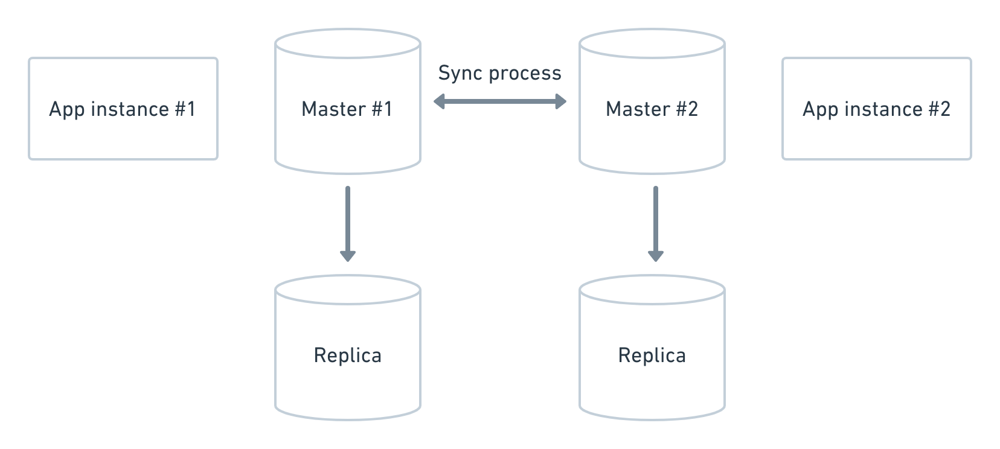

Another possible architecture is having two masters with their own slaves:
- two instances of your app could write to different masters
- each master handles replication for corresponding slaves
- there is a mechanism of resolving conflicts between masters

The easiest example of such architecture is a mobile application with both offline and online mode. For example calendar. Imagine while being disconnected from the network you create a new event in your calendar. This event is saved to local DB or your application. And once you got back online it gets synchronized with cloud database.

#### Example 3

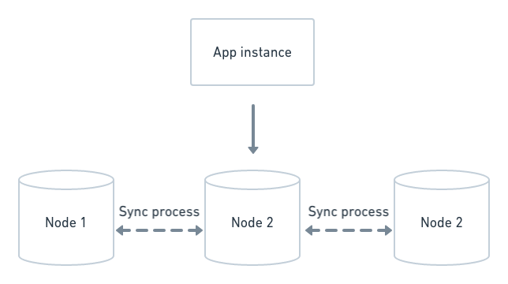

Replication without master(s).

In this schema, application send its data one or more replicas. 

Also there is a process of synchronization among replicas.

### Summary

The main reason of making replication is **high availability**. It means that if one of the node from the cluster is experiencing a downtime, your application will continue to work. Once the failed node is restored, all the data will by safely synchronized to this node and DB will continue to operate in usual mode.

Another reason of having replication is **load balancing**, because all incoming requests could be evenly spread to different servers making your DB faster in general. Replication allows you _scale your reads_, because your can add more replicas and redirect all read requests there, while keeping master doing all CRUD work.

Always remember about replication lag. In case of synchronous replicas this lag is minimal or doesn't exist. In case of asynchronous replicas the lag exists and it can influence your application.

Another thing to remember is that all replicas should have the same version and configuration as master. Because different versions of DB may have different formats of journals, potentially making them incompatible.

## Sharding

Imagine that at some point your DB becomes very huge and as a result all operations became slower. How can we scale a database to overcome this?

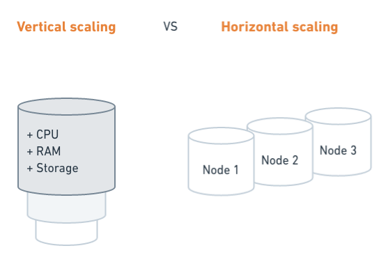

First solution is to buy bigger server node with more compute power (higher CPU and RAM). This is so called **vertical scaling**. This is a viable solution until you have money to do so. But still you may hit the ceiling and either server upgrade will be too expensive or you will have enormous amount of the data to store on a single machine.

Another solution is a **horizontal scaling**, when you add more servers instead of upgrading existing one. And don't confuse this with replication, because replicated node has the same data as master node. But how we can scale horizontally? The technology is called **sharding**.

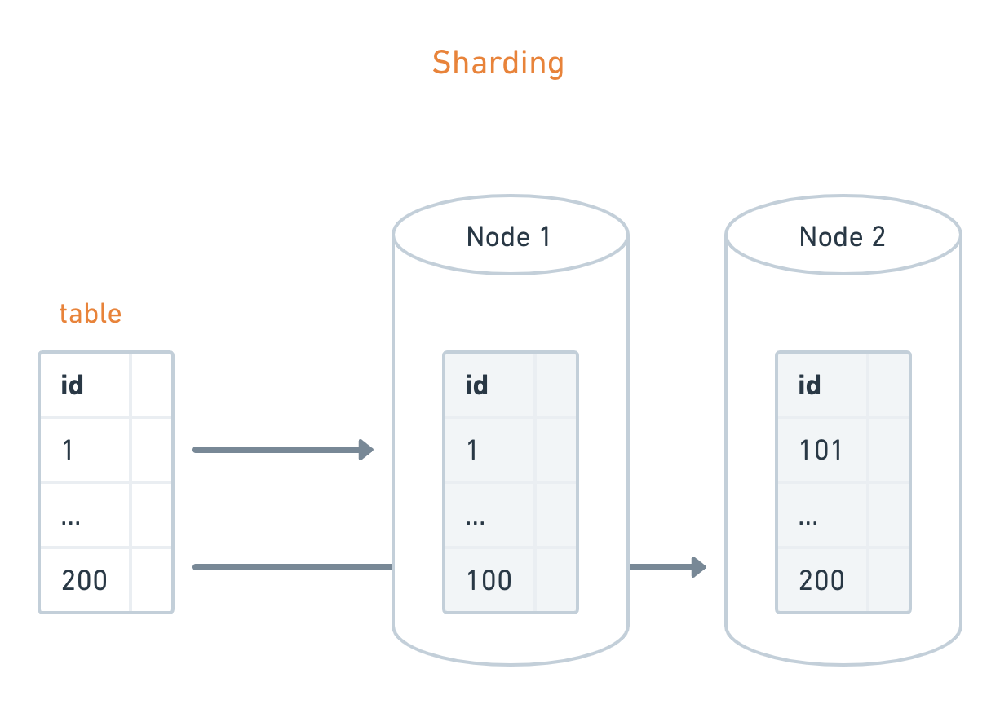

**Sharding** allows us split the data in the table by some key and send to a different nodes. This way, a few less powerful servers can handle much bigger volume of data.

Basically, sharding is a _horizontal partitioning_ – we split one big table into several _logical partitions_, preserving the same schema for each. Basically, each partition represents a **logical shard** of the table. Then, after distributing across different nodes they become **physical shards**. One node of the database can hold multiple logical shards.

Next big question to answer: **how sharding can be implemented**?

Basically, there are at least three common ways:

1. On **application level**. In this scenario, all heavy job of sharding is lying on the application shoulders, because it needs to know _where the needed data is stored_.

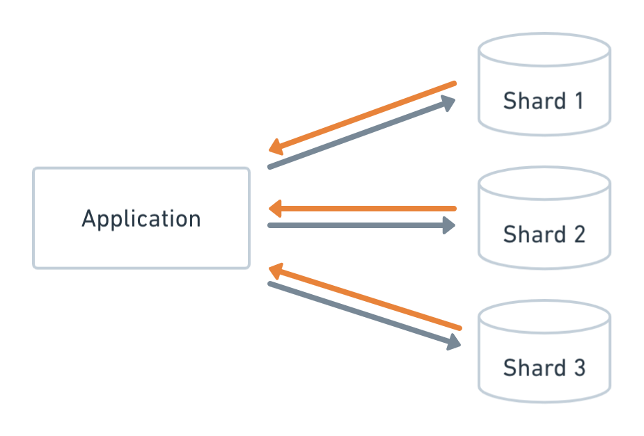

2. On **database level**. In many modern databases sharding is a built-in feature, so you can utilize its capabilities without worrying how to split the data. Of course, there is still a need of a proper configuration of sharded partitions, but at least you don't have to embed this info to the code of your applications. Your clients may even don't know that they are working with a sharded DB.

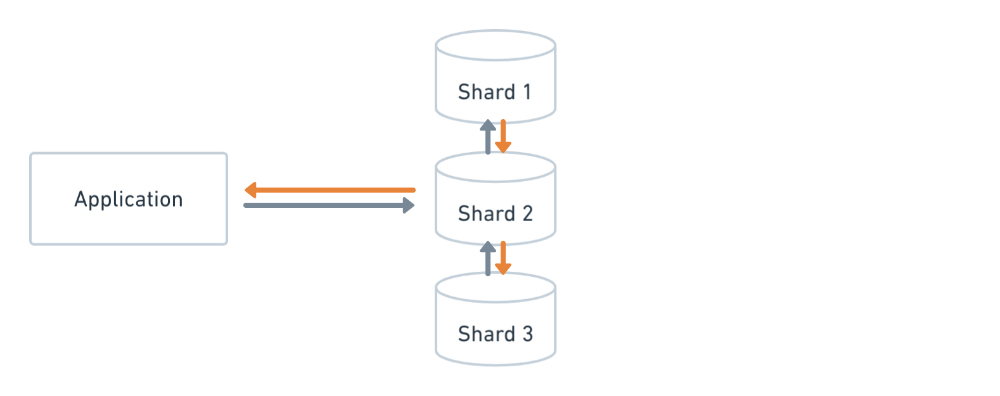

3. Using external **coordination service**. The idea is to outsource sharding to a dedicated service and talk to the service instead of DB. One example of such service is Apache ZooKeeper.

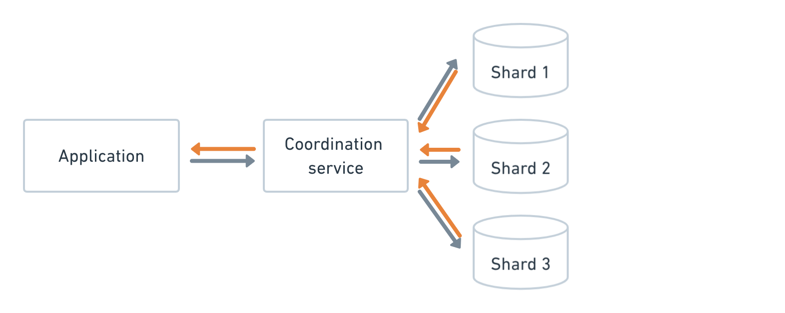

### Ways to split the data

When implementing sharding we need to choose a **distribution key**. Selection of the key is very important, because incorrectly chosen key will lead to problems in the future. Also, there is no silver bullet for such problem, each case is unique and requires careful attention if you decided to do sharding.

Here are several options for distribution key:

1. **Hash-based sharding**. In this approach you start with selecting a _shard key_ (it could be user_id, geo country, email, etc) and then applying a _hash-function_ to this key. The returned result is called a hash value, based on this value you send the record to appropriate physical node (shard). Simplest implementation is applying _modulo_ function to `user_id`:
    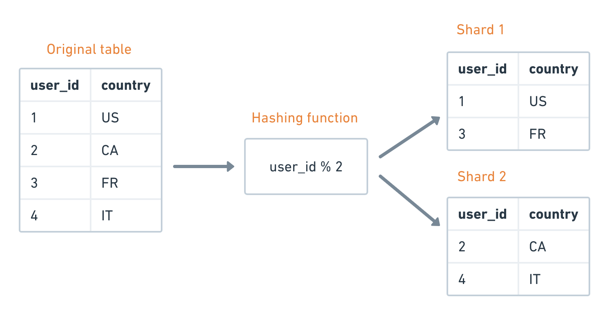
    
    Pros:
    - data is evenly distributed
    - workload is also evenly distributed
    - no need to store any additional meta-information (mapping between record and shard location) because this info is identified by hashing function

    Cons:
    - hard to add/remove nodes from the cluster, because it will require manual re-distribution of the data
    - range-based queries may be inefficient because you need to reach to all shards in the cluster

2. **Value-based sharding**. In this approach you pre-define where your data will live based on the values of the distribution key. To do so, you implement a _mapping_ between key values and shard node location. Sometimes it is easier to implement a _range of values for mapping_, such approach is called **range-based sharding**.

    Let's take the example from point 1 and change it to _value-based sharding_ by country:
    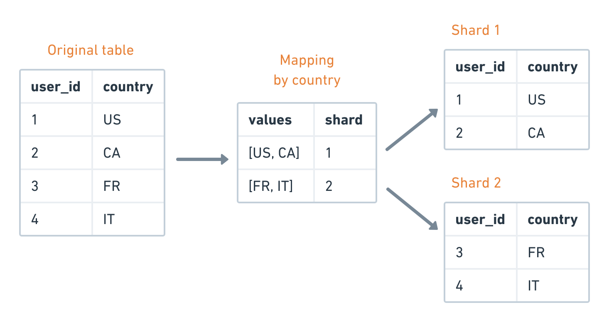
    
    Pros:
    - usually easy to implement
    - intuitive to predict where your data will appear
    - flexibility

    Cons:
    - data may be distributed unevenly
    - uneven distribution of workload (for example, if majority of your users are from US)
    - creation and maintenance of mappings is usually done manually
    - mapping is a single point of failure

### General advices

No doubts, sharding is a complex matter. Usually you turn to sharding when:
- your database is very large and cannot live on a single node
- your DB can't handle amount of incoming requests
- other technical limitations with your current setup

I sharding is inevitable, please carefully prepare for its implementation.

First of all, look at your day-to-day queries. This will give you intuition about use cases and give you ideas of _distribution key_. 

Remember, incorrectly chosen distribution key will lead to **hot spots**. It means that some nodes will be requested more often than others, causing them working much intensive compared to the rest of the cluster.

Second thing, make sure that _you are using partition key in your queries_, otherwise you won't gain any efficiency in queries. If you didn't neglect the rule from previous point, you should be fine. But still worth mentioning.

It is not an end of the world is chosen distribution key led to uneven split of data or hotspots. You can select another key (or correct partition formula) and re-distribute partitions, but it will cost you a downtime (while data is being re-partitioned and re-distributed).

Do a calculation of the size of future shards before applying partitioning, each shard must fit a single node of your cluster. It will save you a lot of time.

When selecting distribution key, make sure that all the data related to the key is accessible on the same shard. For example, let's take `user_id` as a key. If you split tables `customers` and `payments` by the same `user_id` key, you will reduce overhead for the database because if you need to join those tables for particular _user_id_ you will do it on the same node, without need to transfer the data from another shard.

Of course, it is not possible to foresee all the cases and some queries will require reading from different shards, joining them in one place and only after that the data will be available to the client. Such complex queries will have higher response time.

And lastly, **before going into sharding**, check the following solutions:
- try to create one or more replicas to spread the workload
- implement caching for your application
- try dedicated server for your database (if you host DB alongside with other systems)
- add more resources to existing machine (vertical scaling)

### Sharding and replication

To make a resilient system, it makes sense to implement a **replication on each shard node**.

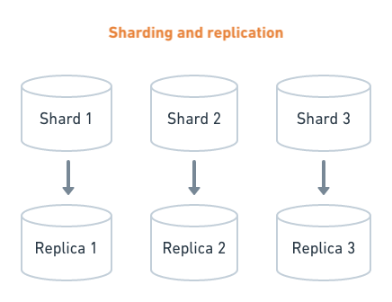

Pros:
- such setup gives you a more resilient cluster, in case of failure on any shard node we have a data backup and can guarantee that our application will continue to work
- even better throughput and performance thanks to replicas
- you can use several average and cheaper nodes instead of one performant and expensive

Cons:
- architecture is pretty complex and thus harder to maintain

### Summary

Sharding is a way to _grow you database horizontally_. It makes sense only if you cannot grow vertically, because it adds an overhead to your architecture.

Sharding is used in a situation when you really have a _lot of data_ which cannot be hold by a single node. In other cases use vertical scaling or caching first.

To make sharding efficient you need to properly split you data using a _distribution key_. Wrong distribution key will lead to uneven workload on nodes (hot-spots) and potential increase of response time.

## Non-relational databases

Relational databases have a lot of advantages:
- they are widely adopted by many companies
- they are easy to understand and visually represent the relation between our objects
- there are many best practices of working with relational data 

One obvious disadvantage of relational model is enforcing the data structure. 

Let's suppose we have a log of events and a set of the fields in this log is not fixed. Moreover, _we may know nothing about the schema_ of this log prior to writing it to database.

For such cases we may use **non-relational databases** which don't enforce required schema to write the data. 

Another name of such class of databases is **NoSQL**. No, it doesn't mean that those databases are against SQL and relational paradigm. It means literally _Not-Only-SQL_.

Such class of non-relational databases is _huge_. One thing that they have in common is that they **don't follow strictly relational model**. Although, they may inherit some parts of this model, but they surely don't follow it completely.

Roughly, there **four main types** of non-relational databases:

- **key-value**
- **document-oriented**
- **columnar**
- **graph**

Let's quickly go though them and try to understand their application and types of data they can store.

### Key-value databases

**Key-value database** is the simplest form of non-relational databases.

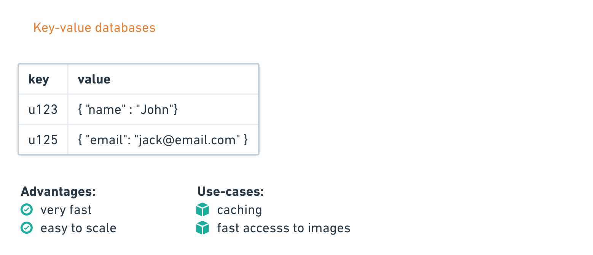

You my think of it as a **dictionary**. Each record is a pair of two items: **key and corresponding value**. Each key should be _unique_. Value can be _any type of data_ (text, JSON, binary format).

This class of databases has two main **advantages**:
1. **very fast** to retrieve a value of any given key. All keys are stored in a special way, so it is very fast to find any particular one.
2. **easy to scale** horizontally. Because keys are independent, we can easily store them on different nodes, which makes sharding an easy feature here.

Because of those advantages, key-value databases have a lot of applications:
- caching (websites, results of queries from relational DBs)
- storing images (or any other binary formats)
- saving users sessions
- etc

One more time: each **value is schema-less**, no restrictions on what is inside. You can store JSON file under one key, image under another, and video under third key. Database doesn't enforce you to store one single type of data.

Examples of key-value databases:
- Redis
- memcached
- Amazon DynamoDB

### Document-oriented databases

Next type of NoSQL databases is called **document-oriented**. All data here is organized in _documents_ (smallest unit of information). Document can be represented as simple JSON, BSON or any other structure (like XML).

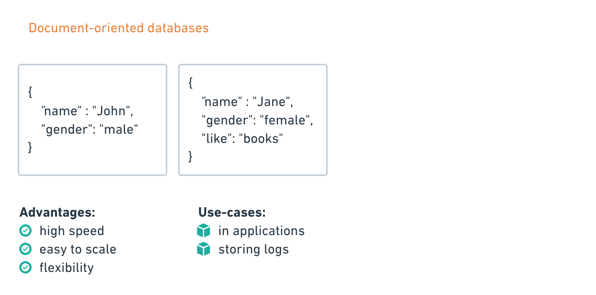

A set of documents usually organize to some collection of similar elements. It is very similar to tables in relational databases. But unlike relational model, each document in the collection can have any arbitrary structure and set of fields. 

_Collection_ is more of a logical set of documents containing the same idea, but not restricting their content. For example, collection called `Products`could store documents with information about products in your store, and each product could have a unique set of parameters to store.

Some document-oriented databases have _some features of relational databases_. For example, in MongoDB you can insert a reference from one one document to another (mimicking relations). These features are made for convenience of the developers, but there was no goal to replicate relational model here.

**Advantages** of document-oriented DBs:
- **speed** of selecting, inserting and changing documents. In many cases bulk-updates are supported
- **flexibility**. Any document can have an arbitrary structure which makes such approach viable for a faster development experience

Examples:
- MongoDB
- CouchDB
- Amazon DocumentDB

### Columnar databases

**Columnar databases** are optimized for fast reads of vast amount of data.

The main difference compared to other approaches is that the data on a disk is stored not row-by-row, but rater each column separately (thus the name). Such way of storing helps when you need to read/search in large amount of information.

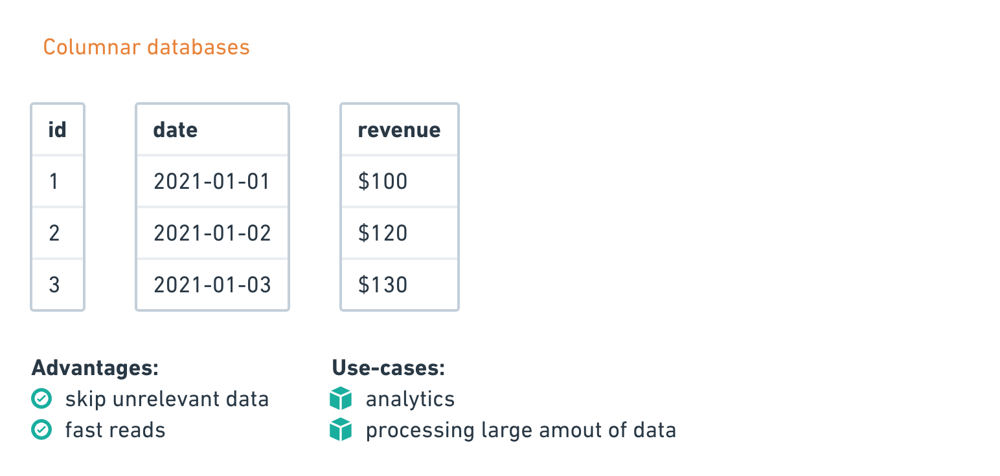

The **main application** columnar databases have found in **analytics**. Typical use-case is when you have a long log of events and you need to do some grouping and aggregation (e.g. unique visitors hourly, average visitors per day, etc).

Columnar databases gain advantage over traditional solutions because they can **skip unused columns** in your query. This helps to read and process much less amounts of data.

Examples:
- Apache Cassandra
- Apache HBase
- ClickHouse

### Graph databases

As name suggested, **graph databases** are used in datasets with relations.

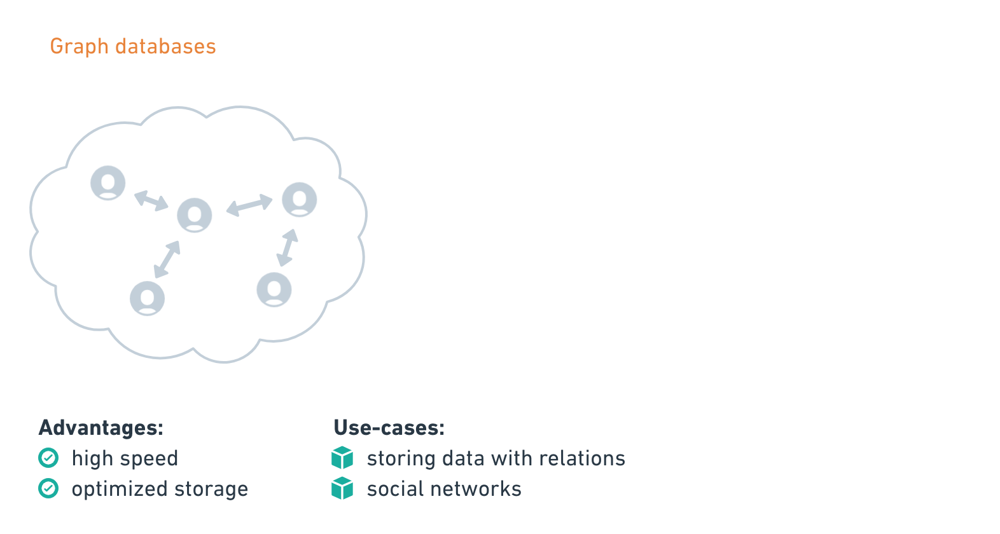

The most obvious example of such datasets is _social network_. You know some friends, they know some other friends, friends of friends have some another friends, and so one. Of course, you can try to store such structure in a relational databases, but it will consume much bigger amount of storage and speed of processing will be slow.

Graph databases can store relations **efficiently**. The data is represented as **nodes** and **relations** between them (also called **edges**). Relations can grow indefinitely in a very flexible way, unlike in relational model where such relations are pre-defined by schema.

Another advantage over relation model is a high speed of selecting of a particular items and their relations. You don't have to join related tables because the data is stored in already optimized way for such operations.

Examples:
- Neo4j
- OrientDB

### Summary for non-relational databases

Non-relational databases is a very interesting class of databases. They can solve a particular problem of your data and your use-case.

Non-relational databases are not replacement for relational ones. As I said, NoSQL databases have their own application, own format of storing the data. They are not better or worse, they are simply different.

## Chapter summary

**Databases** are very important for data engineers and not only.

As I said in the beginning, you don't have to know every little detail about them. Instead you need to know a **general concepts**, their **applications** and **best-practices** when you use exact technology.

Data engineers need to have a _broad knowledge_ about ways of storing and processing data. Most of this knowledge will come with practice. But is still important to understand general ideas behind all concepts I've explained here.

In many cases you will work with already established systems of databases. In such case, given knowledge will help you in debugging the problems, finding a bottle-necks and suggesting a better solutions.

**Happy databasing!**

[Table of content](https://github.com/oleg-agapov/data-engineering-book#table-of-content)
