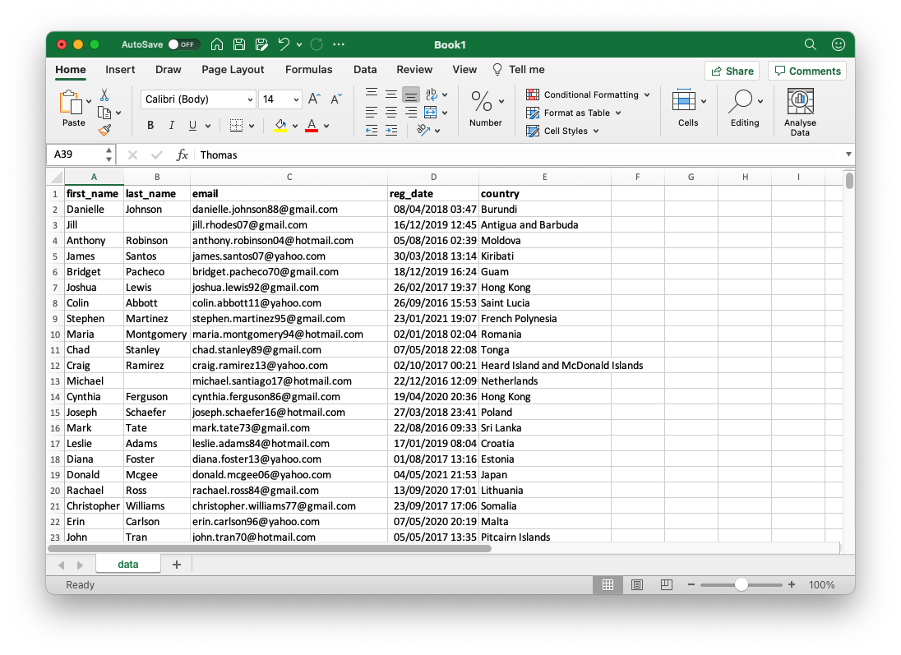

# SQL for beginners


# Introduction

**SQL is a language to query data**.

In most cases it is used to retrieve data from databases. Because SQL is so convenient, it may be used to query data that lives outside of databases (for example, you can use it with plain files).

In day-to-day work of Data Engineers it plays a very important role. It is used to access databases, to connect different datasources together, to describe data pipelines. Actually, every "data" person, be it Data Analyst, Data Scientist or BI Engineer, need to know SQL in order to efficiently do the job.

## So, how do you pronounce "SQL"?

There are two ways:
- pronounce it letter-by-letter like "ess que el"
- or with a word "sequel"

Both variants are correct and here is a story behind the name.

The predecessor of SQL language is another language called DSL/Alpha. It was mostly designed on paper by Dr. Codd in ~1970th. Some time after, a team from IBM designed a simplified version of DSL/Alpha and called it _SQUARE_. Second version of that language called **SEQUEL**, which afterwards was renamed to **SQL**. This language (along with many adjustments and enhancements) is used until now.

In many sources you may find an abbreviation saying that SQL stands for _Structured Query Language_.

## "Enough theory, let's start!"

Sure, I understand your urge to dive into the language and write your first query. But let's do one more stop and discuss what is possible with SQL and after that start learning the syntax.

I will repeat it once again – SQL is a language that allows you to work with data.

The data is usually stored in databases. With help of SQL you will be able to:

- create data and save it to database
- retrieve, filter and aggregate data
- transform data into any way you want
- update and delete data

More rigor approach to define possibilities of SQL is to distinguish three classes of operations with data:
1. SQL data statements (manipulating data)
2. SQL schema statements (to define data structures)
3. SQL transaction statements (to handle transactions, advanced topic)

In this chapter we will look at the first class of statements. It will be enough to cover most of the needs when working with data. Second class of operations (along with some other advanced topics) will be covered in another chapter of this book.

## How to practice SQL?

Now, here is a real question: how can you practice SQL?

Specially for this chapter I've created a small database which contains a few tables with fake data about users and payments. All the examples in this book are tested against this database.

I've prepared a separate [tutorial](how-to-practice.md) about how to install the needed software and where to get the data.

# Basics of SQL

On a very basic level, working with SQL is similar to working in Excel (I hope you worked with Excel before 😀 ).

Imagine you have a big Excel file with information about users of some service:



You can do many operations with this data:
- inspect the data, check existing columns, their values
- calculate the number of rows (by looking at the number of last row or with formula)
- find a specific user by name/surname
- filter the data to see how many users you have from specific country
- and so on

As you can guess, you can do the same with SQL, and many more!

## A bit of database terminology

Before showing you the first SQL command I'd like to explain several definitions used in databases. Knowing them it will be easier to explain some aspects of SQL.


Equivalent of Excel document in database is called a **table**. Basically, a table is a dataset of a similar kind (for example, table with information about users, and only users). Table has fixed number of **columns** (also called fields) and unlimited number of **rows** (also called records). Data within a single column has a single type (like string, number, date, etc). Each record represents a single unit of data, for example information about a single user.

You can have many tables in a database. To group several tables (connected by some logic) there are **schemas**. For example, we may have a schema called **store** which holds tables related to online store (like customers, shippings, products). Schemas are needed to logically separate tables into groups.

## First SQL code

We will start learning SQL with a very simple query. This query will return to you all the records from a table called `users`:

```sql
SELECT *
FROM users;
```

Here what it means:
1. `SELECT` is a required keyword, it instruct database that you want to retrieve data
2. `*` is a wildcard, means that you want to extract all columns from the table (other options will explain later)
3. `FROM` another keyword saying which table you want to query
4. `users` a name of the table you are querying
5. `;` denotes end of SQL statement. In some examples in this chapter I will skip it if the code block contains a single SQL statement

In plain words, the query above is saying "select (and retrieve) all columns from the table `users` and return them to me". This example is similar to simple opening an Excel file: you see all the data at once, all the columns and rows.

## SQL syntax features

There are a few lessons you need to learn before going further:

1. Keywords are reserved words in SQL. It means that you won't be able to use that to name tables and columns (however it will depends on a database you are using). No worries if you don't know all of them, just pay attention to this fact.
2. For SQL it is actually doesn't matter if you write keywords in upper- or lowercase (`SELECT` or `select`). But as a good rule, try to make all keywords uppercased and all the identifiers (name of tables and columns) in lowercase.
3. Each complete SQL query ends with `;`. It means that you can split you query on multiple rows however you want, or write it on a single line:
    ```sql
    SELECT * FROM users;
    ```
4. `SELECT` is a required keyword, you cannot skip it. `FROM` is also required when you selecting data from a table (however, in some databases it can be optional). And the order of these two commands is important. You cannot write `FROM` before `SELECT`!

## Selecting columns and limiting the result

A table in a database can be actually very huge (millions/billions of rows). So the first example has a "bad smell", because it can give you some troubles when throwing billions of rows at once.

A better option is to add `LIMIT` clause to it:

```sql
SELECT * 
FROM users
LIMIT 10
```

This will return you first 10 records from the table. 

> `LIMIT` should always go as the very last clause, otherwise you will get an error.

Another thing to do is to limit the number of returned columns. You can do it by specifying the list of column names (delimited by comma) after `SELECT`:

```sql
SELECT first_name, last_name, country
FROM users
LIMIT 10
```

This query will return only three columns (`first_name`, `last_name`, `country`) and first 10 records.

Sometimes you may need to create a new column witр a static value. In SQL you can easily do that:

```sql
SELECT
  'static column'
  , id
  , first_name
FROM users
LIMIT 10
```

## Filtering data with WHERE

The next step is data filtering. It can be done with a help of another keyword `WHERE`. It is placed always after `FROM` statement:

```sql
SELECT first_name, last_name, country
FROM users
WHERE country = 'China'
LIMIT 10
```

After `WHERE` keyword you need to put a **condition of filtering**. In my example, the condition is:
```sql
country = 'China'
```

You can put conditions on any column. Also, you are not limited only to equality checking, here is a few more:

<table>
  <tr>
    <th>Condition</th>
    <th>Description</th>
    <th>Example</th>
  </tr>
  <tr>
    <td>>, >=, <, <=</td>
    <td>Inequality. Good for numbers and dates</td>
    <td>
      <code>WHERE id >= 2</code>
    </td>
  </tr>
  <tr>
    <td>!=</td>
    <td>Not equal. When you want to get all opposite values</td>
    <td>
      <code>WHERE name != 'John'</code>
    </td>
  </tr>
  <tr>
    <td>IN (...)</td>
    <td>Check if the value is in some set. Set can consist any data types (strings, numbers, dates, etc)</td>
    <td>
      <code>WHERE country IN ('France', 'Germany')</code>
    </td>
  </tr>
  <tr>
    <td>LIKE 'some_string'</td>
    <td>Used for finding strings and substrings. You can use "%" as a wildcard, meaning it will denote any number of characters (see example)</td>
    <td>
      <code>WHERE email LIKE '%@gmail.com'</code>
      <p>Extract all emails with arbitrary characters at the beginning and ending with "@gmail.com"</p>
    </td>
  </tr>
  <tr>
    <td>BETWEEN x AND y</td>
    <td>Used for specifying a range condition. Useful for numbers and dates. Both sides are included in the output</td>
    <td>
      <code>WHERE purchase_date BETWEEN '2021-01-01' and '2021-01-01 23:59:59'</code>
      <p>Get all purchases happened on January 1st</p>
    </td>
  </tr>
</table>

A few examples:

```sql
-- example of LIKE operator
SELECT *
FROM users
WHERE email LIKE '%@yahoo.com';

-- example of IN operator
SELECT *
FROM users
WHERE country in ('France', 'Germany');
```

A few eagle eyes of you spotted a new syntax here – comments!

```sql
-- this is a single-line comment

/* 
this is a multi-line comment.
it can go on few lines
*/
```

## Multiple conditions

Alright, knowing how to filter your dataset you may want to apply more sophisticated conditions. What if you want to get a list of all Johns from United States?

To solve such problems you can combine multiple conditions with **logical operators** `AND`, `OR` and `NOT`.

Logical operator `AND` will return you rows that satisfy both conditions on its sides:

```sql
-- all Johns from United States
SELECT id, first_name, country
FROM users
WHERE first_name = 'John' AND country = 'United States'
```

Logical operator `OR` with return you rows that satisfy at least one condition:

```sql
-- returns you all Johns (no matter the country)
-- and everyone from United States (no matter the name)
SELECT id, first_name, last_name, country
FROM users
WHERE first_name = 'John' OR country = 'United States'
LIMIT 5
```

Finally, logical operator `NOT` will revert the condition to the opposite:

```sql
-- return all users who don't use @bing.com email domain
SELECT id, email
FROM users
WHERE NOT email LIKE '%@bing.com';

-- even better: put NOT before LIKE so it feels more natural
-- it will also work with IN operator (email NOT IN (...))
-- but won't work with =, !=, and inequalities
SELECT id, email
FROM users
WHERE email NOT LIKE '%@bing.com';
```

Also, you can combine conditions in longer chains using conditional operators.

```sql
SELECT *
FROM users
WHERE id >= 500
  AND email LIKE '%bing.com'
  OR country IN ('United States', 'Canada')
```

But wait, how do you know in the example the precedence of conditions? 

In databases, `AND` has higher priority than `OR` (just like a multiplication operation takes precedence over an addition operation). For example:

```sql
SELECT first_name, last_name, country
FROM users
WHERE 
  first_name = 'John'
  OR
  first_name = 'Bella' AND country = 'Brazil'
```

This query will give you all users with name John (from any country) and with name Bella, but only from Brazil.

If you find it hard to remember the order, you can use a trick – **round brackets**. The same rule as in math – operations in brackets have a highest priority:

```sql
SELECT *
FROM users
WHERE 
  first_name = 'John'
  OR
  (first_name = 'Bella' AND country = 'Brazil')
```

This is basically the same query as above, but it feels much easier to read and understand!

## NULLs

Sometimes, when inserting data to a table, some data values may be missing. For example, if customer decided not provide you with their last name or gender. Or, it may happen that you don't have the value just right now, e.g. delivery date.

You need somehow indicate missing values. For such cases `NULL` data type exists.

`NULL` means exactly that **data value does not exist**. It is not the same as empty string `""` or zero `0`. You may think of it as a _placeholder_ for cases when data was not provided.

To check the column for `NULL` emptiness you may use `IS` operator:

```sql
-- get all users who skipped last_name field
SELECT first_name, last_name
FROM users
WHERE last_name IS NULL
```

To get all non-empty rows you may use `IS NOT NULL` condition:

```sql
SELECT first_name, last_name
FROM users
WHERE last_name IS NOT NULL
```

# Aggregations

So far we worked mostly with raw datasets and extracted all rows at once. But in many cases you don't need all rows, you may need some _statistics_ or _aggregated information_ about them. For example, _how many rows (records) you have in the table_, or _what is the average value of the column_.

For this purpose SQL provides many **aggregation functions**.

## Counting rows

Easiest aggregation function is **counting the number of rows**:

```sql
SELECT count(*)
FROM users
```

This query will return you number of rows in the `users` table.

Aggregation functions must be placed after `SELECT` keyword.

Inside `count()` I put asterisk wildcard, which means "count all rows". However, you may provide a column name instead. In such case it will count the number of non-NULL rows using this column:

```sql
SELECT count(id)
FROM users
```

This example will returns the same number of rows as `count(*)` syntax because column `id` is usually doesn't contain NULLs.

You can put several aggregation functions in the same query:

```sql
SELECT 
  count(*),
  count(last_name)
FROM users
```

so you can return multiple aggregations at the same time.

Last thing about `count()` function is additional syntax with `distinct` keyword:

```sql
SELECT 
  count(distinct first_name)
FROM users
```

will return number of unique values in the column `first_name`.

> Always remember that both `count(...)` and `count(distinct ...)` do not count rows with `NULL` values!

## More functions: sum, min, max, avg

Other popular aggregation functions are:
- `sum()` calculates the sum of a provided column
- `min()` returns minimal value
- `max()` returns maximal value
- `avg()` returns average

Will demonstrate their application with `payments` table:

```sql
SELECT
  sum(gross_revenue), -- sum of all elements in revenue column
  min(gross_revenue), -- minimum value of revenue
  max(gross_revenue), -- maximum value of revenue
  avg(gross_revenue) -- average value
FROM payments
```

> Pay attention to the fact that some databases can't properly handle NULLs in aggregation functions. That being said, if you will try to sum up a column which contains NULL(s), you will be returned a NULL.

## Math operations with columns

Sometimes you may want to apply some math operations with different columns. 

One example would be calculating some business metrics that includes several aggregations, like "Average Revenue Per User". This metric is calculated as the sum of revenue divided by the number of unique users. 

You can add, subtract, multiply and divide columns easily with SQL, in a very natural way:

```sql
SELECT 
  sum(gross_revenue) / count(distinct user_id)
FROM payments
```

Also, you can do it with non-aggregated columns as well. It will does the operation element-wise (meaning will be applied to each row individually):

```sql
SELECT 
  gross_revenue * tax_rate - 0.30
FROM payments
```

## Aliasing

One thing may bother you during this chapter: after applying the aggregation,  the column names are weird. You can easily fix that with **aliases**.

Alias will rename the output column to the desired name. It is possible to give aliases to tables as well (it will be useful later, however). Use keyword `AS` for applying alias:

```sql
SELECT 
  sum(gross_revenue) / count(distinct user_id) as avg_revenue_per_user
FROM payments
```

Aliases cannot have spaces and starting with a number. However, if you really need to do so, just wrap the alias in double quotes (e.g. `"Avg Revenue per User"`)

```sql
SELECT 
  sum(gross_revenue) / count(distinct user_id) as "Avg Revenue per User"
FROM payments
```

> You can give alias to non-aggregated columns as well.

Similarly, you can alias tables and reference columns names by that alias:

```sql
SELECT 
  u.id, -- calling a column "id" by table alias
  u.email
FROM users as u -- alias "users" table as "u"
```

However, such aliasing will be useful on later stages of learning (when we start joins).

## Aggregations and filters

So far we looked on aggregations which we applied for the whole table. However it is not always the case. I'd say the other way around – most of the time you want to know aggregation of some filtered data. You can do it easily by adding `WHERE` conditions!

Let's count the number of Johns from United States:

```sql
SELECT
  count(id)
FROM users
WHERE country = 'United States'
  AND first_name = 'John'
```

## Math operation don't change the source data

It's important to mention that math functions over raw data do not change the source data.

For example, consider the following example:

```sql
SELECT
  gross_revenue * (1 + 0.2) AS gross_revenue
FROM payments
```

Here I increased `gross_revenue` column by 20% and renaming the result to `gross_revenue`. However, the source data remains unchanged. You can easily compare the source data and new column by running:

```sql
SELECT
  gross_revenue AS source_gross_revenue,
  gross_revenue * (1 + 0.2) AS gross_revenue
FROM payments
```

# Grouping and aggregation

There is another use case you may want to achieve with aggregations.

Let's take `users` table as example. Using aggregation function `count()` you can easily calculate how many records (e.g. users) you have in your table. But how would you know "_what is the split of your users per each country_"? In other words, you want to know how many users you have in each country.

You can imagine that you potentially have hundreds of different countries, so making a separate query with filter + aggregation for each country will be very time consuming and un-efficient. Luckily for you there is **grouping functionality**.

## Basic grouping example

**Grouping in SQL** allows you calculate aggregations over some group of columns.

Going back to discussed earlier use case, you want to know how many users you have per each country. So, what you could do in SQL is to define a **group of columns over which you will run aggregation functions**.

The syntax is following:

```sql
SELECT 
  country, 
  count(id) as count_users
FROM users
GROUP BY country
```

Now, step by step:
1. After `SELECT` statement you define two things: 
    - grouping column(s) (`country` in our case)
    - aggregation function(s) (`count(id)` in our case)
2. add `GROUP BY` statement at the bottom with columns, over which we are grouping our data (e.g. `country`)

You add more than one columns for grouping, just put the same columns to `GROUP BY` statement. Also, you can add as many aggregation functions as you like.

## Grouping with filters

In SQL you actually can mix grouping and filtering.

Let's modify our previous example with countries split by filtering only users with `@bing.com` accounts:

```sql
SELECT 
  country, 
  count(id) as gmail_users
FROM users
WHERE email LIKE '%@bing.com'
GROUP BY country
```

As you can see, you can easily mix `GROUP BY` and `WHERE` statements to achieve more precise information.

Pay attention to the _order of statement_:
1. `SELECT` is always first
2. then `FROM`
3. `WHERE` is always after `FROM`
4. `GROUP BY` is after `WHERE`

## Sorting data (ordering)

To make a returned result more convenient for end-users we could apply **sorting**.

In SQL you can order both _columns_ and _aggregates_.

Ordering can be done via `ORDER BY` statement:

```sql
-- will be sorted by country name alphabetically
SELECT
  country, 
  count(id) as count_users
FROM users
GROUP BY country
ORDER BY country;

-- will be sorted by number if users ascending
SELECT
  country,
  count(id) as count_users
FROM users
GROUP BY country
ORDER BY count_users;

-- you can specify descending order by adding DESC keyword.
-- such query represents "top 10 countries by registered users" 
-- because it has LIMIT statement
SELECT
  country,
  count(id) as count_users
FROM users
GROUP BY country
ORDER BY count_users DESC
LIMIT 10;
```

A few things to know about `ORDER BY` statement:
- it can be used _without_ `GROUP BY` statement. Can be useful if you need a list of entries of the table sorted by some column
- in conjunction with grouping, `ORDER BY` should always go after `GROUP BY`
- for aggregated columns you can use aliases. However it not a problem to put the aggregation function instead:
    ```sql
    ORDER BY count(id)
    ```
- `ORDER BY` statement can take more then one column for sorting:
    ```sql
    ORDER BY first_name
           , last_name
           , country DESC
    ```

## Conditions on aggregated column

Last thing you may want from grouping is to have ability to filter by _aggregated values_.

For example, let's find users with unique first name. To do that you need:
1. group the `users` table by `first_name` column
2. count the number of each name
3. filter only rows where count of users for a name is equal to 1

One thing you may want to do is to add some condition to `WHERE` statement. However, you will fail because `WHERE` conditions can work only with non-aggregated data (with "raw columns").

To filter by aggregated column you need to use `HAVING` condition:

```sql
SELECT
  first_name,
  count(id) as count_users
FROM users
GROUP BY first_name
HAVING count_users > 1
```

`HAVING` should always go after `GROUP BY`.

Similarly to `WHERE` statement, `HAVING` filters can be complex and include more than one condition.

## How to write a complex query and not get lost

By the time of reading this section you are probably overwhelmed with the number of statements, conditions and their ordering, especially if you are learning SQL for the first time.

To help you with that I've prepared a _template_ which should give a bird view on all statements and their connection:

```sql
SELECT 
  /* [Required] one or more columns and aggregations */ 

FROM   
  /* [Required] table name */

WHERE
  /* [Optional] one or more conditions to the dataset */

GROUP BY
  /* [Optional] grouping columns if using aggregations */

HAVING
  /* [Optional] conditions for aggregated columns */

ORDER BY
  /* [Optional] sorting columns */

LIMIT
  /* [Optional] number of rows in output dataset */
```

# Column functions

When working with data in table format (like Excel file or table in database) you often need to somehow transform the data to get new formats.

Here is a few examples of transformations you may need:
- join `first_name` and `last_name` to a single `full_name` column
- apply math transformations, for example apply exchange rate for prices or calculate tax based on gross values
- extract year from a date column

That's why in SQL exist **column functions**. Their purpose is to apply transformations to the columns so that you can use those new columns in your queries, e.g. for filtering (in `WHERE`), aggregations (in `GROUP BY`), sorting.

**Column functions does not change the existing data** in the table! The transformation is applied only to the resulted dataset, so don't worry, you won't hurt the source data.

> Some functions may have different names in different databases. Thus, please refer to the documentation of your database to find alternatives.

## String functions

Here is a list of most used **string functions**:

```sql
SELECT
  /* lower() converts the column to lowercase */
  lower(first_name) as lower_name,

  /* upper() converts the column to UPPERCASE */
  upper(last_name) as upper_surname,

  /* || allows concatenate two columns or strings */
  /* MySQL alternative: concat() function */
  first_name || ' ' || last_name as full_name,

  /* length() returns the length of the string */
  /* MySQL alternative: len() */
  length(email) as length_of_email
FROM users
```

A few more use-cases:
- turning a column to lowercase is a nice trick to compare two strings:
    ```sql
    -- finding all John-s in userbase.
    -- because users may save their names written differently
    -- ("John", "JOHN", "JoHn")
    SELECT
      count(first_name)
    FROM users
    WHERE lower(first_name) = 'john'
    ```

- you can mix column functions, e.g:
    ```sql
    SELECT
      length(lower(first_name) || lower(last_name)) as full_name_length
    FROM users
    ```
  
- use column functions with grouping:
    ```sql
    -- let's find all users with unique full names
    -- to do that we need first aggregate all users by full names
    -- and then apply HAVING to find only single ocurrences
    SELECT
      first_name || ' ' || last_name as full_name,
      count(id) as count_users
    FROM users
    GROUP BY first_name || ' ' || last_name
    HAVING count_users = 1
    ```

## Math functions

**Math functions** allows you apply some math transformation to your data.

We already saw some useful math functions in [aggregations section](#Aggregations):
- `count()`
- `sum()`
- `min()`
- `max()`
- `avg()`

> Remember all 5 functions above are applicable only when aggregating data or grouping data

Other useful math functions are:
- `round(number, precision)` – rounds a number to a specified number of decimal places (precision)
- `sqrt()` – returns a square root of the number
- `power(a, b)` – raises `a` to the poser of `b`. Here `a` and `b` could be either numbers or columns

Lastly, usual math operations like `+`, `-`, `*`, `/` work well with both numbers and columns.

Example:
```sql
SELECT
  round(gross_revenue * (1 - tax_rate), 2) as net_profit
FROM payments
```

## Date functions

In many situations you need to work with dates and time. For example, create a daily aggregations of visitors of the website, calculate monthly sales, etc. For such cases you may need to use **date functions**.

> In different databases date functions may have different names and meaning! Please refer to the documentation of your database when working with dates.

Here is a list of some date functions in SQLite database:
```sql
/* SQLite database */

SELECT
  reg_date -- original date
  
  -- truncate datetime to format YYYY-MM-DD
  , date(reg_date)

  -- also date() can convert string and cast it to date (YYYY-MM-DD)
  , date('2021-01-01')

  -- datetime can cast with time (YYYY-MM-DD HH:Mi:SS)
  , datetime('2021-01-01 23:59:59')

  -- returns current timestamp (YYYY-MM-DD HH:Mi:SS)
  , current_timestamp

  -- date() with modifiers: you can easily add or subtract days/months/years/etc
  , date('2021-01-01', '+1 day')
  , date('2021-01-01', '-1 month')

  -- difference between two date in days.
  -- can be fractional (not full days) and negative (for dates in past)
  -- about Julian Day: https://en.wikipedia.org/wiki/Julian_day
  , julianday(reg_date) - julianday('2021-01-01')
FROM users
```

In the following query I'll show how to do similar operations with data in MySQL database (another popular free database):

```sql
/* MySQL database */

SELECT
  reg_date -- original date
  
  -- convert date or string to format YYYY-MM-DD
  , date(reg_date)
  , date('2021-01-01')
  
  -- date with time
  , timestamp('2021-01-01 23:59:59')

  -- returns current timestamp (YYYY-MM-DD HH:Mi:SS)
  , current_timestamp

  -- to achieve date in future or past you can ad subtract intervals.
  -- after INTERVAL keyword you need to specify quantity and period
  , reg_date + INTERVAL 1 DAY as next_day
  , reg_date - INTERVAL 1 MONTH as month_ago

  -- difference between two dates in days 
  -- (whole days, without fraction of the day)
  , datediff('2021-01-01', reg_date)
FROM users
```

As you can see, some functions are similar between SQLite and MySQL, and some are different. In any case, official documentation is your friend to find needed functionality.

Another thing to point out is date representation as a string. In many databases when you write a date as a string (e.g. '2021-01-01 00:00:00') it will be correctly interpret as date/time, so you don't have to explicitly convert it to date type:

```sql
SELECT *
FROM users
WHERE reg_date BETWEEN '2021-01-01 00:00:00' AND '2021-01-31 23:59:59'
```

However, some databases may require to use date function to convert string to a proper date.

## Conditional functions

Last portion of column functions I'm going to show are the **conditional functions**. They will help you simplify your life when working with data.

### coalesce()

Function `coalesce(column_1, column_2, ...)` takes two or more arguments (columns or other values like strings, numbers) and return first non-NULL argument.

Principle of work:
- check if _first_ argument is NULL. if yes, go to the next step, otherwise return the argument
- check if _second_ argument is NULL. if yes, go to the next step, otherwise return the argument
- and so on

It is useful when you need to assign some default value to the column, e.g. if numeric column is empty substitute it with zero:

```sql
SELECT
  coalesce(gross_revenue, 0)
FROM payments
```

### Case statement

Case statement is a conditional function which can check multiple conditions and act corresponding to those condition.

Basic syntax of `case` statement is following:
```sql
case 

  when /* condition 1 */ -- (required)
    then /* returned value if condition 1 is truthy */

  when /* condition 2 */ -- (optional)
    then /* returned value if condition 2 is truthy */

  /* more "when" branches if needed */
  
  else -- (optional)
    /* returned value if none of the conditions are truthy */

end
```

It looks hard, but will become simpler with practice.

### Example 1. Easiest CASE statement

Create a column which return a string "It is a John" if first name of the user is John. And return NULL otherwise:

```sql
SELECT
  case
    when first_name = 'John' then 'It is John'
  end as is_john
FROM users
```

You can use grouping with new column `is_john` to find how many Johns you have compared to other users:

```sql
SELECT
  case
    when first_name = 'John' then 'It is John'
    end as is_john
  , COUNT(1)
FROM users
GROUP BY is_john
```

### Example 2. CASE with ELSE

Modify first example so it return "It is not John" instead of NULL.

```sql
SELECT
  case
    when first_name = 'John' then 'It is John'
    else 'It is not John'
  end as is_john
FROM users
```

### Example 3. Multiple conditions

This time let's count the number of users registered this year, last year and all the rest.

Do do so let's use CASE statement and create a new column with the following conditions:
- if user registered this year return string 'Registered this year'
- if user registered in previous year return string 'Registered last year'
- in all other cases return 'All the rest'

```sql
SELECT

 case
    -- first let's check if registration year is equal to current year
    -- strftime('%Y', date) returns a year (YYYY) from a provided date
    when strftime('%Y', reg_date) = strftime('%Y', current_timestamp)
      then 'Registered this year'

    -- second condition is checking if registration year
    -- is equal to previous year.
    -- to find previous year I subtract 1 year from current timestamp
    when strftime('%Y', reg_date) = strftime('%Y', date(current_timestamp, '-1 year'))
      then 'Registered last year'
    
    -- lastly, if no conditions were satisfied, return ELSE statement
    else 'Registered more then two years ago'
  end as registration_period
  
  , count(1)
FROM users
GROUP BY registration_period
```

> CASE statement is evaluated top to bottom. It means that if at least one condition was met, it will stop evaluating other conditions and will return the value from `then` block.


# Summary

Congratulations, you've done with SQL basics and now can do a lot with data! 

In this chapter we've discovered many topics, from basic selecting and filtering, to more advanced aggregations and groupings.

If you made this far and have any questions feel free to open a ticket [here](https://github.com/oleg-agapov/data-engineering-book/issues).

Also, any other feedback is appreciated via [this form](https://docs.google.com/forms/d/e/1FAIpQLSeYSxyQcNyXIyQeD1DtR6q2zHO7heGGUQ36PqW--XdRL01Wqg/viewform).

---

[Table of content](/README.md)

