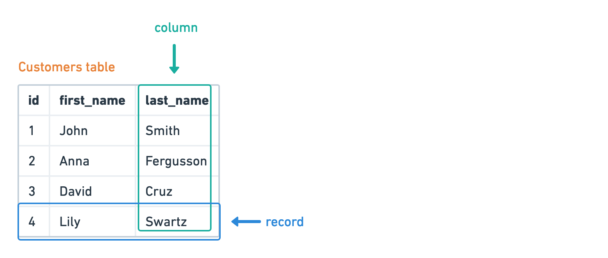
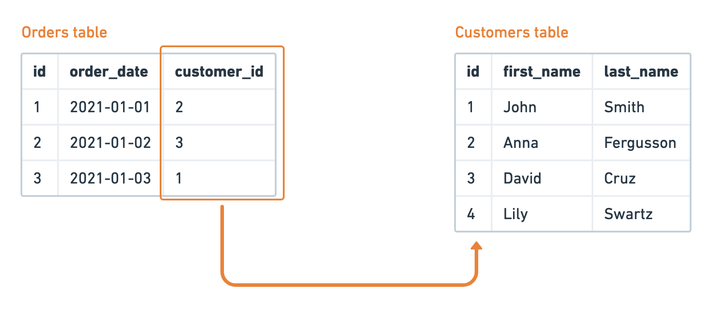
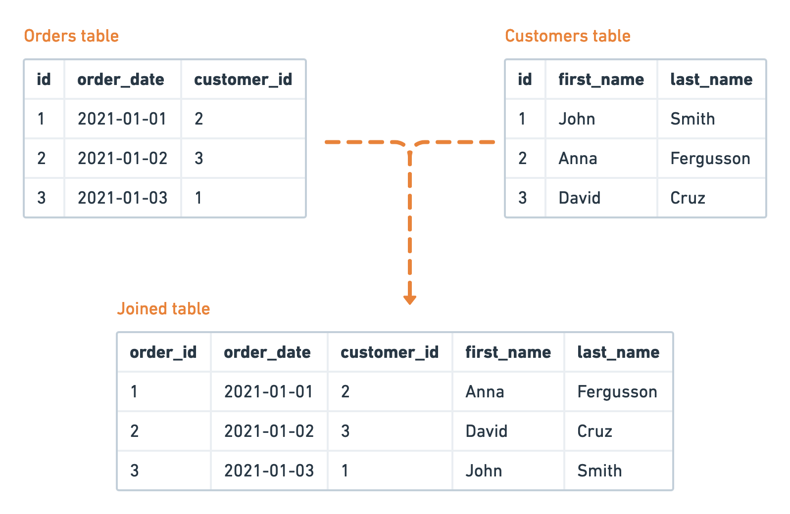
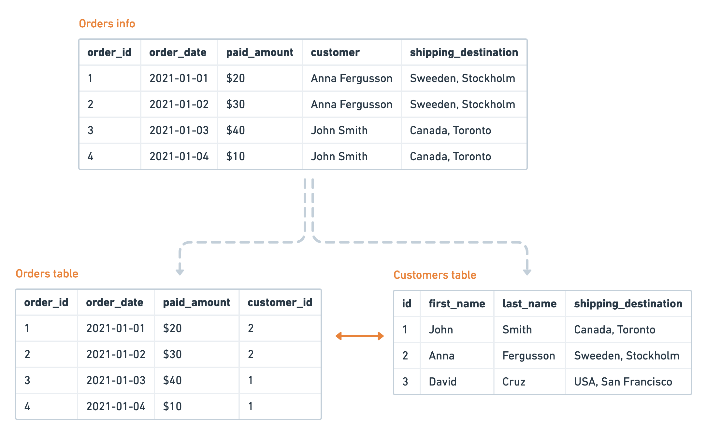
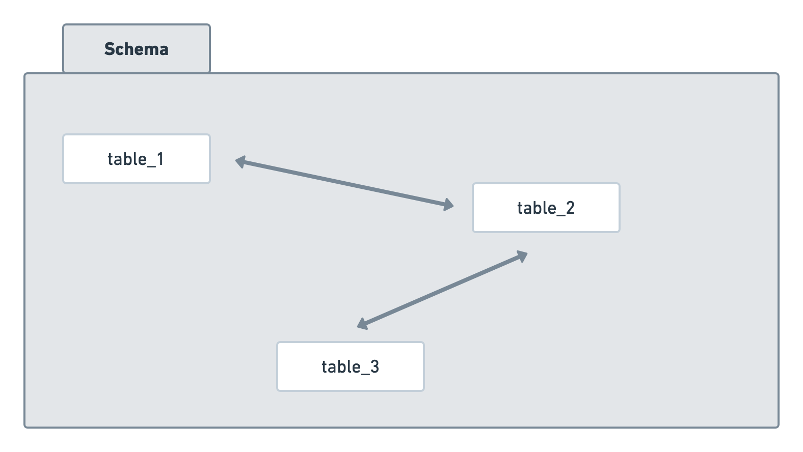
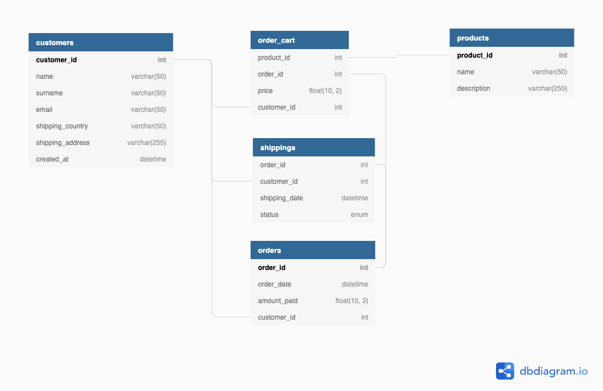

# SQL for beginners

## Introduction

SQL is very popular language in a modern Computer Science landscape.

The language is popular because it has proved its practical need when working with data. At first SQL was a language that described a mental odel of working with relational data, but its implementation appeared to be so successful, that many years later we still find new way of using it. For example, in Big Data world it is still used for querying data, but now not only from relational models.

In day-to-day work of Data Engineers it plays an important role. It is used to access databases, connecting different datasources together using the power of SQL. Actually, every "data" person, be it Data Analyst, Data Scientist or BI Engineer, need to know SQL in order to efficiently do their jobs.

In this chapter I'd like to give a guide for an absolute beginners to start using SQL. The path consits of the following steps:

1. Introduction to relational model. It is a foundation to understand many SQL-related things
2. Creation of tables and relations with SQL
3. Populating tables with data
4. Extracting data using SQL
5. Making aggregations with SQL

## Relational model and birth of SQL

SQL is a language that allows you to work with data in databases. With its help you can:

- create tables with data
- select data, apply filters, aggregate data
- delete and update data

Before we dive in into its syntax and application, let’s make one step backwards and discuss a bit how data in databases is organized and stored.

On a very high level, we can split all databases into two types: relational and non-relational. SQL can be applied to both  types of databases, but initially it was designed to work with exactly relational model. So, what is the difference between relational and non-relational models?



In **relational model** (proposed by Dr. Codd in 1970) all data is stored as a set of **connected tables**. Data of similar kind is stored in one table. For example, let's suppose we have _customers_ table. Each table consist of **columns** (also called fields) and **rows** (also called records). Data within a single column has a single data type (string, number, date, etc). Each record represents a single unit of data, customer's info in our case. Table has no limitation on how many rows can be stored, but it is limited by physical factors (like amount of free space on the storage).

Different tables may have be related to each other. For example, let's suppose that we want to store information about orders of our customers. In such model we should be able to connect orders and customers table. The connection (or relation) is expressed via keys. In customers table we have a column called customer_id – unique identifier of the customer. It is called a **primary key**, because knowing customer_id you can identify all information, which corresponds to that customer.



Similarly, orders table also has customer_id column. It is pointing to a record in customers table and called a **foreign key**.

Primary key is not always a number. For example, we could pick name/surname columns as a key. Such types of keys are usually called **natural keys**. And customer_id is called a **surrogate key**. When you are going to select which type of the key to use, please remember that primary keys once assigned shouldn't change and be unique. In our example, name + surname is a bad choice because the last name can change for a person and, obviously, two persons may have exactly the same full names.



Data from different tables with relations may be combined into a single result set to present more information at once. In database terms, this operation is called **joining** of tables. There are several types of joins, for different use cases.

Every dataset should be "optimized" in a certain way to comply with the relational model. For example, it does not have any benefits to store customer's name and surname, shipping address, etc in orders table, such data is redundant there. First of all, such format will consume more storage space, secondly, it will be costly to update the table if customer changed his information. Thus, such info is extracted to customers table and customer_id field is included to both tables. Now, in case of any changes of customer's data, you will change it in a single place – customers table. Such process is called a **normalization**. There are a few rules how to make your data normalized and 6 normal forms.



All the terminology above concerned mostly relational model and relational databases, but what about non-relational databases? Well, a lot of definitions can be applied to some of such databases as well. For example, non-relational databases may have tables, relations, etc. But as a rule, every non-relational database is unique in its features and was designed to solve a specific problem of IT world. Some databases are good for caching, some for storing raw logs, performing analytics and many more. But most importantly, they may or may not support SQL. Because of that reason, such kind of databases will be skipped in this chapter.

### Brief history of SQL

The predecessor of SQL language is another language called DSL/Alpha. It was mostly designed on paper by Dr. Codd along with relational model. Some time after, a team from IBM designed a simplified version of DSL/Alpha and called is _SQUARE_. Second version of the language called SEQUEL, which afterwards was shortened to **SQL**.

Later, in the middle of 1980's, the American National Standards Institute (ANSI) started working on the first standard for the SQL. First standardized release was published in 1986. Language keep evolved and got a subsequent releases of the standard. Latest stable release was introduced in 2019.

Funny thing, some people (including me in past) may think of SQL as acronym to Structured Query Language, which is not true.

Last thing about SQL you need to know is that it is a **declarative, non-procedural language**. You don't to understand the meaning of those words in order to use the language, but in my opinion it is usefull to 

Declarative (as contrary to imperative) means that when writing a query in SQL you need to express the "what" – desired result you want to achieve, but not "how" the result should be achieved. It makes it easier for beginner to start using SQL.

Non-procedural language means that SQL does not have many functionality of usual programming languages: control flow instructions, loops, functions, etc. However, many databases have special procedural flavours of SQL (PL/SQL in Oracle database, PL/pgSQL in PostgreSQL, etc), which will extend functionality of pure SQL. I won't touch such languages in this chapter.

### How to practice SQL

There are many ways you can practice SQL.

Easiest way is to open your browser and search for SQL online quizzes. I will not recommend any specific quizzes, because it is a matter of taste. But I will recommend one online editor called [DB-Fiddle](https://www.db-fiddle.com). There you can create your own database and then run queries against your data.

A bit harder way to practice is to install one of the open-source databases on your computer and play with it. I can recommend [MySQL](https://www.mysql.com/) or [PostgreSQL](https://www.postgresql.org/). After installation of the database you will need either use built-in command-line tools to perform queries or install 3rd party programs to access it, for example [DBeaver](https://dbeaver.io/).

Syntax of SQL can vary in different databases, however most of them are trying to follow the ANSI standard. Throughout the chapter I will use MySQL as my primary database, so all the examples will 100% work in this database, and with higher chances on other databases.


## SQL, part 1: creating of schemas and tables

Let's start discovering SQL with the first step – creation of tables and schemas. But before, it is worth explaining how data is organized in databases (DB).

As you already know from previous section, data is organized in tables. Table is a set of columns and rows (pretty much how it looks like in Excel spreadsheet). Next, tables are organized into schemas, sometimes interchangeably called databases (don't confuse this term with "database" as a software). So, in order to create your first table you need to create a schema for it (or use an existing one).



So the first command you should learn is a command `show schemas;` to list all existing schemas in the database:

```sql
mysql> show schemas;

+----------------------------------+
| Database                         |
+----------------------------------+
| information_schema               |
+----------------------------------+
1 row in set (0.02 sec)
```

In MySQL at least one schema exists in freshly installed database which is `information_schema`.

To see the list of all tables inside a schema you may run the following:

```sql
mysql> show tables from information_schema;

+---------------------------------------+
| Tables_in_information_schema          |
+---------------------------------------+
| CHARACTER_SETS                        |
| CLIENT_STATISTICS                     |
| COLLATIONS                            |
....
| VIEW_TABLE_USAGE                      |
+---------------------------------------+
78 rows in set (0.03 sec)
```

Here I truncated the output. As you can see, we have 78 tables in `information_schema` (however in your case this number may be different).

Congrats! Now you know how to inspect the schemas and their tables with those two commands!

### A few words about syntax and styling

Every SQL statements consist of:
- reserved keywords which defines actions you perform (like SHOW, CREATE, etc)
- additional metadata you will need to provide to your query (like table name, columns you want to see, etc)
- always end with semicolon `;` (this way your database will know that you are finished with the query and will start processing it)

SQL syntax is case insensitive, which means that the following queries are totally identical:

```sql
show schemas;

SHOW schemas;

SHOW SCHEMAS;
```

There are no particular rules how your SQL code should be formatted. However it is strongly encouraged to have a style guide for all your queries and follow it strictly. It will keep your code clean and understandable for your colleagues and yourself from the future will will say "thank you".

To the start, you can take this [style guide](https://www.sqlstyle.guide).

### Creating schemas and tables

Now you know how to inspect database, it's time to create your first schema and table in it.

To create a new schema use `CREATE` syntax:

```sql
CREATE SCHEMA <schema_name>;
```

If such schema doesn't exist, it will create it. If the schema with such name exists, it will raise an error. You can use option `IF NOT EXISTS`, so the error will not occur:

```sql
CREATE SCHEMA IF NOT EXISTS my_schema;
```

Also, please remember that not all users have privileges to create schemas and tables. Usually database administrator (DBA) can give you such rights.

Now, suppose you've created your own schema `my_schema`. To switch to this schema and use it by default, you can write:

```sql
USE my_schema;
```

After execution of this command, all subsequent instructions with tables will be executed under this schema (unless another schema is specified explitly). Great, time to create your first table.

Let's create a table `customers` with information about our users. This table will contain such fields:

- customer_id  – primary key of customers table, integer number
- first_name – name of the customer, string type
- last_name – surname of the customer, string type
- date_of_birth – obviously, date type

To create a table we will use `CREATE` syntax once again, but now with slightly different instructions:

```sql
CREATE TABLE IF NOT EXISTS my_schema.customers
(
	customer_id INT PRIMARY KEY,
	first_name VARCHAR(50),
	last_name VARCHAR(50),
	date_of_birth DATE
);
```

Whoa, a lot of stuff is happening here. Let's go step-by-step:

- `CREATE TABLE IF NOT EXISTS my_schema.customers` is the instruction to create a table called `customers` inside schema `my_schema`. You can skip the schema name if you already switched to one with `USE my_schema;`.
- On next lines you need to specify columns of the table and their data types. About types I will talk in a moment. We've created all four columns.
- Lastly, pay attention to `customer_id` definition. It has a `PRIMARY KEY` keywords, which as you might expect will turn this field to a primary key.

Great! Now you have your first table created.

### Data types

As you noticed, we need to supply a data type for each column. In ~95% of databases these data types are named the same, so once you learn some, high chances that they will work in other database.

Here is a short table with main data types in MySQL and their description.

> Be advised, this is not a comprehensive list of data types! These are the most essential and used in 95% of the cases, so should be enough to start. We may spot some other types during this chapter.

### String types

Use it to describe characters data:

<table>
  <tr>
    <th>Type name</th>
    <th>Description</th>
    <th>Allowed values</th>
    <th>Application</th>
  </tr>
  <tr>
    <td>CHAR(N)</td>
    <td>Character data type with fixed lengths of maximum N chars. Not used places will be right-padded with spaces, so this type always consume the same number of bytes</td>
    <td>Max length is 255</td>
    <td>Useful when your data has a fixed length, for example country codes (US, CA, etc)</td>
  </tr>
  <tr>
    <td>VARCHAR(N</td>
    <td>Character data type with variable lengths strings with maximum of N chars. Blank characters won't be filled with spaces, so you will save some storage space</td>
    <td>Max length is 65,535</td>
    <td>General purpose strings of variable length, like names, emails, etc</td>
  </tr>
  <tr>
    <td>TEXT</td>
    <td rowspan=3>For storing long texts. Pay attention, that in different databases maximum allowed bytes are different</td>
    <td>Up to 65,535 bytes</td>
    <td rowspan="3">Storing long texts</td>
  </tr>
  <tr>
    <td>MEDIUMTEXT</td>
    <td>Up to 16,777,215 bytes</td>
  </tr>
  <tr>
    <td>LONGTEXT</td>
    <td>Up to 4,294,967,295 bytes</td>
  </tr>
</table>

A few advices for selecting correct string data type:
- if string you are trying to save is bigger than the assigned length of text field, the overflowing characters will be removed. Also, trailing spaces won't be removed
- because strings could be not only represented by Latin characters (almost any non-English language), you may need to instruct your table to use special character set:

    ```sql
    VARCHAR(50) CHARACTER SET big5_chinese_ci;
    ```

    Also, you may apply any character set to the whole database so you don't have to specify it each time:

    ```sql
    CREATE DATABASE chinese_customers CHARACTER SET big5_chinese_ci;
    ```

    To list all [supported character sets in MySQL](https://dev.mysql.com/doc/refman/8.0/en/charset-charsets.html) just run:

    ```sql
    SHOW CHARACTER SET;
    ```

### Numeric types

There are whole (integer) and floating-point numeric types.

Integer types can be signed (with "+" or "-") and unsigned. In the latter case, the interval will be doubled on top border.

<table>
  <tr>
    <th>Type name</th>
    <th>Description</th>
    <th>Allowed values</th>
  </tr>
  <tr>
    <td>TINYINT</td>
    <td rowspan="5">Whole (integer) numbers</td>
    <td>Signed: −128 to 127<br>
    Unsigned: 0 to 255</td>
    <td></td>
  </tr>
  <tr>
    <td>SMALLINT</td>
    <td>Signed: −32,768 to 32,767<br>
Unsigned: 0 to 65,535</td>
  </tr>
  <tr>
    <td>MEDIUMINT</td>
    <td>Signed: −8,388,608 to 8,388,607<br>
Unsigned: 0 to 16,777,215</td>
  </tr>
  <tr>
    <td>INT</td>
    <td>Signed: −2,147,483,648 to 2,147,483,647<br>
Unsigned: 0 to 4,294,967,295</td>
  </tr>
  <tr>
    <td>BIGINT</td>
    <td>Signed: −2^63 to 2^63 - 1<br>
Unsigned: 0 to 2^64 - 1</td>
  </tr>
  <tr>
    <td>FLOAT(p, s)</td>
    <td rowspan="2">For floating-point numbers you need to specify:<br>
* precision – the total number of digits allowed in the data<br>
* scale – number of allowed digits after the decimal point</td>
    <td rowspan="2">A lot :)</td>
  </tr>
  <tr>
    <td>DOUBLE(p, s)</td>
  </tr>
</table>

When using numeric data types:

- try to guess the biggest number you want to store in the table and use appropriate data type. Otherwise, you will use more storage space than it should be
- pay attention, that unsigned floating-point types don't double the top border, they simply don't have negative numbers
- when using floating-point types you may also [experience specific problems](https://dev.mysql.com/doc/refman/8.0/en/problems-with-float.html)
- presented allowable values are valid for MySQL database, but may vary a lot in other databases. Before using any particular data type please refer to the documentation of the database you are going to use.

### Date and time data types

<table>
  <tr>
    <th>Type name</th>
    <th>Description</th>
    <th>Allowed values</th>
    <th>Application</th>
  </tr>
  <tr>
    <td>DATE</td>
    <td>Dates in format YYYY-MM-DD</td>
    <td>1000-01-01 to 9999-12-31</td>
    <td>Useful when you need to specify a date without exact time. <br>
    For example, shipping date.</td>
  </tr>
  <tr>
    <td>DATETIME</td>
    <td>Date in format YYYY-MM-DD HH:MI:SS</td>
    <td>1000-01-01 00:00:00.000000 to 9999-12-31 23:59:59.999999</td>
    <td>Used when you know the exact data and time of some event. <br>
    For example, moment of account creation, purchase order, etc.</td>
  </tr>
  <tr>
    <td>TIMESTAMP</td>
    <td>Dates in format YYYY-MM-DD HH:MI:SS. Internaly timestamps are represented as amount of seconds passed since January 1, 1970.</td>
    <td>1970-01-01 00:00:00.000000 to 2038-01-18 22:14:07.999999</td>
    <td>Useful for compliance with external systems which use timestamps.</td>
  </tr>
  <tr>
    <td>YEAR</td>
    <td>Storing year in format YYYY</td>
    <td>1901 to 2155</td>
    <td></td>
  </tr>
  <tr>
    <td>TIME</td>
    <td>For storing elapsed time in format HH:MI:SS</td>
    <td>−838:59:59.000000
to 838:59:59.000000</td>
    <td>When you need to capture time passed between two events.</td>
  </tr>
</table>

### Special data types

These are data types which are too special to put them to any of the categories above.

<table>
  <tr>
    <th>Type name</th>
    <th>Description</th>
    <th>Allowed values</th>
    <th>Application</th>
  </tr>
  <tr>
    <td>ENUM (item1, item2, ...)</td>
    <td>Enumerator data type. In brackets you need to provide a list of acceptable strings (delimited by comma)</td>
    <td>Strings in quotes, e.g. ('apples', 'bananas')</td>
    <td>Useful when you want to enforce values only from a specified set of items.</td>
  </tr>
</table>


## Foreign keys

Remember when we talked about relational model we discussed _primary_ and _foreign_ keys for a table? You've seen already how to create primary key. Now let's learn how to create a table with a foreign key.

Short refresher – _foreign key_ is a column in the table which references a primary key of another table.

Let's create a table called `orders` which will have a relation with customers table we've created in previous section. It will be a simple table with order ID (primary key), total paid amount and customer ID (foreign key):

```sql
CREATE TABLE my_schema.orders
(
	order_id INT PRIMARY KEY,
	paid_amount FLOAT(5, 2) NOT NULL,
	customer_id INT UNSIGNED,

  CONSTRAINT fk_customers_customer_id FOREIGN KEY (customer_id) 
		REFERENCES customers (customer_id)
);
```

Ok, this code includes two new things we need to discuss in details.

First of all, you can see that column `paid_amount` column has a flag `NOT NULL` after the type definition. This simply means that this field cannot be left empty when inserting data into the table. I specified this flag because I want to make sure that whenever the new order is being inserted in the table, it has a `paid_amount` value. Once again, NULL means absence of the data, it is not the same as zero (0), empty string ("") or a space (" ").

Second thing to pay your attention is the `CONSTRAINT` syntax. In general, constraints are used to describe additional conditions on your columns. You can use constraints to describe primary and foreign keys. I haven't used it for primary key, but will do for a foreign key.

You need to provide the following parameters to make this statement work correctly:

1. name of the constraint (arbitrary unique string, e.g. `fk_customers_customer_id`)
2. column used as a foreign key (`customer_id`, from `orders` table)
3. which field it references and in which table (`customer_id` field in `customers` table)

## Checking table's definition

Now, we have two tables created (`customers` and `orders`). In most cases, you will have a deal with tables created by other people. If you ever will want to see their properties (primary keys, foreign keys, nullable columns, etc) you will need to use `DESC` syntax:

```sql
DESC my_schema.customers;
```

You will see the output like:

```sql
+---------------+------------------+------+-----+---------+-------+
| Field         | Type             | Null | Key | Default | Extra |
+---------------+------------------+------+-----+---------+-------+
| customer_id   | int(10) unsigned | NO   | PRI | NULL    |       |
| first_name    | varchar(50)      | YES  |     | NULL    |       |
| last_name     | varchar(50)      | YES  |     | NULL    |       |
| date_of_birth | date             | YES  |     | NULL    |       |
+---------------+------------------+------+-----+---------+-------+
```

I think that output is pretty self-explanatory. You immediately see data types of the columns, `customer_id` column is not-nullable primary key, etc.

## Deleting tables and schemas

Deleting tables and schemas is easy as well with SQL. 

To remove a schema (database) simply run:

```sql
DROP DATABASE [IF EXISTS] my_schema;
```

When I type syntax in square brackets (like `[IF EXISTS]` command), it means that this part is optional and you can use it if you need to.

To remove a table run:

```sql
 DROP TABLE [IF EXISTS] my_schema.customers;
```

Again, you need to have a permissions to remove schemas and tables, so consult with your database administrator if you need such rights.


## [Optional part] Practice example #1. Design a schema from scratch

> This section of the chapter is totally optional, so feel free to skip it if you want. No new material will be given here.

Now we can put all our new knowledge to practice and create our first schema with tables for a real-world example. Well, the example will be fictional, but all the tables will be very real!

Let's consider a following example. Imagine that you were hired to design a database for a simple online store of electronics.

You need to design a schema for a store with the following data entities:

- customers information (required fields: name/surname, email, shipping address)
- orders information (required fields: order date, content of the shopping cart, amount paid in USD)
- shipping information (required fields: shipping date, current status of shipment)

Woah, a lot of data we need to crunch, but worry not! We will be doing it step-by-step.

### Step 1. Looking at the data

First table will be `customers` table. Let's look into data coming to us:

**customers:**

- name: John
- surname: Smith
- email: john.smith@email.com
- shipping country: Canada
- shipping address: E 41 Ave, Vancouver
- account creation date: 2021-01-01 12:16:01
- customer_id - a primary key for the table, will be used to reference customers from other tables

**orders:**

- order_date: 2021-01-01 12:20:45
- shopping cart: [Apple iPhone 12, Apple iPad Air4]
- amount_paid: $1298
- order_id: primary key
- customer_id: foreign key, will reference customers table

**shippings:**

- order_id: reference to orders table, foreign key
- customer_id: reference to customers table, foreign key
- shipping_date: expected date of shipping
- status: current status of the shipment, one of: new, packed, shipping, delivered

### Step 2. Normalizing data

Ok, the data seems clear, you may even recognize some patterns and relations between the tables. At least for customers and shippings tables there shouldn't be any questions. But for orders table I see two problems:

1. shopping_cart column contains a list of items. While it is possible to store such type of data in some databases, it is usually a sign that the table is not normalized enough
2. amount_paid column contains a total amount, but it is not possible to extract a price of each item in the cart. It is also a problem of de-normalization

To solve both issues let's introduce another table called order_cart, which will store records for each item in the cart for every order_id:

**order_cart:**

- order_id: reference to orders table, foreign key
- item: description of the item
- price: price of the item
- customer_id: reference to customers table, foreign key

Looks good? Almost :) To make this schema even better, let's also create a table called products, so our order_cart table will reference it and doesn't store a raw description of the item. This way we will save up some storage space and avoid problems in case we will need to schange some product description:

**products:**

- product_id: primary key
- name: name of the product
- description: description/characteristics of the product

Now it looks good. Time to code all the scripts to bootstrap all the tables.

### Step 3. Creating tables

But I will use one trick here ;) I won't code everything myself, I'll use an external tool where I can visualize my schema and generate all CREATE statements.

The tool is called [dbdiagram.io](http://dbdiagram.io/) and it is a free online generator of DB schemas. Because the tool itself (and its syntax) is out of the scope of this chapter, I'll give you a final result without explaining how it was done. However, the syntax is trivial and you can create your own schema by exploring [starting template](https://dbdiagram.io/d).

Final result you can find here: [https://dbdiagram.io/d/603957befcdcb6230b21b7db](https://dbdiagram.io/d/603957befcdcb6230b21b7db)



From the defined data model you can export CREATE statements for PostgreSQL, SQL Server and MySQL. I will export it to MySQL.

Generated file with creation scripts [is here](./assets/practice-1.sql).

### Step 4. Practicing in online editor

Next I want to create my schema. I'll use online editor [db-fiddle.net](http://db-fiddle.net) this time.

First of all, create your own database and activate it:

```sql
CREATE DATABASE IF NOT EXISTS online_store;

USE online_store;
```

Run the code above in "Schema SQL" tab, because this is where you suppose to create tables and schemas. To executing your code press Run button at the top of CTRL+Enter shortcut.

Now you can copy-paste generated code from dbdiagram model after schema creation code and run it once again.

Next step is to verify that schema and tables were create. In "Query SQL" tab paste the following code and run it:

```sql
SHOW databases;

SHOW TABLES FROM online_store;

DESC online_store.orders;
```

So, let's see what is going on here:

- first statement will show you a list of databases. You should see "online_store" in the list
- second statement will reveal all the tables we've created (customers, orders, etc)
- last statement will show you a definition of orders table

Here is a fully working example: [https://www.db-fiddle.com/f/vRBx4BThc27fvwQrM5yqnF/1](https://www.db-fiddle.com/f/vRBx4BThc27fvwQrM5yqnF/1)

Done! Go ahead and review all the steps and try to replicate yourself. Good luck!

